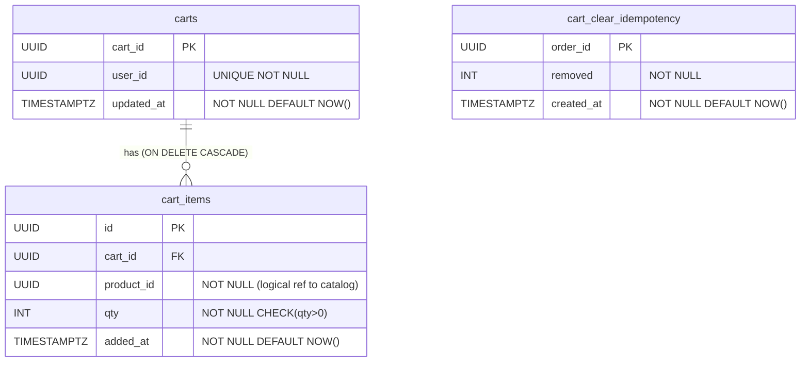

# ERD — Cart Service

## Schema owner

- Service: `cart`
- Postgres schema: `cart`
- Default `search_path`: `cart, public`

---

## Aggregate boundaries

This service contains two aggregates:

**Cart** (root: `carts.cart_id`) — the source of truth for a customer's pending purchase intent. One cart per authenticated customer, enforced by `UNIQUE(user_id)`. The cart is a mutable, lightweight container; it stores no prices (fetched live from Catalog at read-time).

**CartClearIdempotency** (root: `cart_clear_idempotency.order_id`) — an idempotency log for the `cart.clear-on-checkout` internal call. Keyed on `order_id` (UUID v7, globally unique). Records the `removed` count from each successful clear so replay calls return the cached value without re-executing the DELETE.

---

## Tables

### `carts`

| Column     | Type        | Null     | Default | Comment                                       |
|---|---|---|---|---|
| cart_id    | UUID        | NOT NULL | —       | PK; UUIDv7 generated by cart service          |
| user_id    | UUID        | NOT NULL | —       | FK (logical) to identity.users.id; UNIQUE     |
| updated_at | TIMESTAMPTZ | NOT NULL | NOW()   | Refreshed on every add/update/remove mutation |

- **PK:** `cart_id`
- **Indexes:**
  - `UNIQUE INDEX ON carts(user_id)` — enforces one cart per customer
- **Constraints:**
  - `user_id NOT NULL`
  - `updated_at NOT NULL`
- **FK note:** `user_id` references `identity.users.id` logically — NOT enforced at the DB layer (schema isolation; cross-service refs are by UUID only per `cross-cutting.persistence`).
- **Owner aggregate:** Cart.

---

### `cart_items`

| Column     | Type        | Null     | Default | Comment                                              |
|---|---|---|---|---|
| id         | UUID        | NOT NULL | —       | PK; UUIDv7 generated by cart service                 |
| cart_id    | UUID        | NOT NULL | —       | FK to carts.cart_id ON DELETE CASCADE                |
| product_id | UUID        | NOT NULL | —       | Logical ref to catalog.products.product_id (no DB FK)|
| qty        | INT         | NOT NULL | —       | Units in cart; CHECK (qty > 0)                       |
| added_at   | TIMESTAMPTZ | NOT NULL | NOW()   | Timestamp of first add; NOT reset on merge           |

- **PK:** `id`
- **Indexes:**
  - `INDEX ON cart_items(cart_id)` — fetch all items for a cart
  - `UNIQUE INDEX ON cart_items(cart_id, product_id)` — enforces one-line-per-SKU invariant (CART-006)
- **Constraints:**
  - `FK (cart_id) REFERENCES carts(cart_id) ON DELETE CASCADE` — enforced within the `cart` schema
  - `UNIQUE (cart_id, product_id)` — the ON CONFLICT target for the add-item merge upsert
  - `CHECK (qty > 0)` — DB-layer guard; the service layer handles qty=0 as a delete before this point
  - `product_id NOT NULL`
- **No price column:** price is fetched live from `catalog.product.detail` at read-time. Snapshot is taken at `checkout.commit` and persisted on `order.order_items.price_snapshot` — not in the cart.
- **FK note:** `product_id` references `catalog.products.product_id` logically — NOT enforced at DB layer (schema isolation).
- **Owner aggregate:** Cart.

---

### `cart_clear_idempotency`

| Column     | Type        | Null     | Default | Comment                                                  |
|---|---|---|---|---|
| order_id   | UUID        | NOT NULL | —       | PK; the orderId supplied by Checkout (CHK-010)           |
| removed    | INT         | NOT NULL | —       | Rows deleted in the successful clear; cached for replay  |
| created_at | TIMESTAMPTZ | NOT NULL | NOW()   | Timestamp of original clear operation                    |

- **PK:** `order_id`
- **Indexes:** none beyond PK (point-lookup only)
- **Constraints:**
  - `removed NOT NULL`
  - `created_at NOT NULL`
- **Idempotency pattern:** `INSERT INTO cart_clear_idempotency (order_id, removed, created_at) VALUES ($1,$2,now()) ON CONFLICT (order_id) DO NOTHING` — committed in the same transaction as the DELETE, so the record is atomic with the cart mutation.
- **No TTL in MVP:** `order_id` is a UUIDv7 (globally unique); rows grow at order-creation rate. A background prune job (DELETE WHERE created_at < now() - INTERVAL '90 days') is deferred to post-MVP.
- **Owner aggregate:** CartClearIdempotency.

---

## Relationships

```
carts (cart_id PK, user_id UNIQUE)
   │
   │ FK ON DELETE CASCADE (within cart schema — enforced)
   ▼
cart_items (id PK, cart_id FK, product_id)
   │
   │ UNIQUE (cart_id, product_id) — ON CONFLICT target for merge upsert
   │
   ▼
[catalog.products — logical ref via product_id UUID; NOT enforced at DB layer]
[identity.users   — logical ref via carts.user_id;  NOT enforced at DB layer]

cart_clear_idempotency (order_id PK)
   │
   └── logical ref to order.orders.order_id (NOT enforced at DB layer)
```



---

## Invariants

- **One cart per customer:** `carts.user_id UNIQUE` — attempting to create a second cart for the same user results in a DB constraint violation; the service uses UPSERT (get-or-create) to avoid this.
- **One line per SKU per cart:** `cart_items(cart_id, product_id) UNIQUE` — two adds for the same product merge into one row via ON CONFLICT DO UPDATE. The constraint prevents phantom duplicate lines.
- **qty is always positive in persisted rows:** `cart_items.qty CHECK (qty > 0)` — the service layer converts qty=0 into a DELETE before the DB write, so this CHECK is a belt-and-suspenders guard.
- **No price in cart:** `cart_items` has no price column. All pricing is live from Catalog at read-time. This prevents stale-price bugs where a stored price diverges from the catalog after an admin update.
- **No stock reservation in cart:** the cart service never writes to the inventory schema and never calls `inventory.reservation.create`. Reservation happens at `checkout.commit` only (INV-002).
- **Cross-user isolation:** every query filters on `user_id` extracted from JWT claims. No handler accepts a `userId` parameter from the request body for data-access scoping (except `cart.clear-on-checkout`, which validates `customerUserId == claims.Sub` before use).
- **Idempotent clear:** `cart_clear_idempotency.order_id` PK ensures that a replay of `cart.clear-on-checkout` with the same `orderId` returns the cached `removed` count without re-executing the DELETE — even if called concurrently, the INSERT ON CONFLICT DO NOTHING is safe.

---

## Concurrency model

- **Add-item concurrent same-SKU:** two concurrent `INSERT … ON CONFLICT DO UPDATE` for the same `(cart_id, product_id)` serialize on the UNIQUE row lock. The losing transaction blocks briefly, then succeeds; final qty = sum of both adds. No deadlock risk (single row).
- **Update-item vs remove-item race:** last-writer-wins on `cart_items.qty`. No explicit lock needed; pgx single-statement UPDATE/DELETE is atomic.
- **Clear-on-checkout concurrent replay:** `INSERT INTO cart_clear_idempotency ON CONFLICT (order_id) DO NOTHING` handles concurrent replays safely — the first writer wins, subsequent writers are no-ops.
- **Lock-order pin:** not applicable. The cart schema never locks more than one `cart_items` row per operation (the bulk DELETE in `clear-on-checkout` uses `WHERE id=ANY(...)`, which takes row locks in Postgres heap order — no custom ordering needed, as the cart service does not join multiple lock sets that could deadlock).
- **Hot rows:** `carts.cart_id` is the hot row for add/update/remove operations on active shopping sessions. Expected concurrency is low per-user (one active browser tab); no row-level sharding needed for MVP.

---

## Migration history

| Migration                              | Adds                                                                 | Applied |
|---|---|---|
| `001_create_carts.sql`                 | `cart.carts` table with PK + UNIQUE(user_id) + updated_at           | initial |
| `002_create_cart_items.sql`            | `cart.cart_items` table with PK + FK + UNIQUE(cart_id, product_id) + CHECK(qty>0) | initial |
| `003_create_cart_clear_idempotency.sql`| `cart.cart_clear_idempotency` table with PK (order_id)              | initial |

---

## Snapshot vs live-source policy

The cart service owns **no snapshot columns**. All product data (sku, name, image, currentPrice, status) is fetched live from `catalog.product.detail` at `cart.read` time.

The **price snapshot** is taken at `checkout.commit` and persisted on `order.order_items.price_snapshot` — owned entirely by the Order service. This is by design: the cart's subtotal is informational and advisory; the authoritative price is locked at order creation.

This policy means:
- If an admin raises or lowers a product price, the cart immediately reflects the new price on the next read (no stale data).
- If a product is deactivated, the cart flags the line `checkoutable=false` on the next read without any background job.
- The cart's `subtotal` field in the response is explicitly documented as informational; `checkout.commit` recomputes it authoritatively (CHK-005).

---

## Change log

| Date       | Author                                    | Change                                          |
|---|---|---|
| 2026-05-08 | Tech-Designer (Claude Sonnet 4.6, dry-run #2) | Initial ERD; three tables documented; invariants and concurrency model authored |
