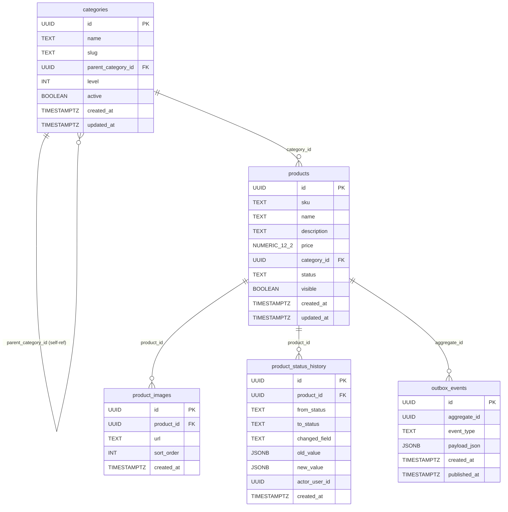

# ERD — Catalog Service

## Schema owner

- Service: `catalog`
- Postgres schema: `catalog`
- Default `search_path`: `catalog, public`

---

## Aggregate boundaries

This service contains two aggregates:

**Product** (root: `products.id`) — the source of truth for product definition, pricing, status, and images. A Product owns its images (`product_images`) and its audit trail (`product_status_history`). The outbox table (`outbox_events`) is also owned by the Product aggregate — every `product.created` and `product.updated` event is produced inside a Product transaction.

**Category** (root: `categories.id`) — the source of truth for the catalog taxonomy. A Category is self-referencing (tree structure via `parent_category_id`). Categories are referenced by Products via `category_id` FK but Products are not part of the Category aggregate — deactivating a Category does NOT cascade into its Products.

---

## Tables

### `categories`

| Column | Type | Null | Default | Comment |
|---|---|---|---|---|
| id | UUID | NOT NULL | `gen_random_uuid()` | PK |
| name | TEXT | NOT NULL | — | Display name |
| slug | TEXT | NOT NULL | — | URL-safe identifier; globally unique |
| parent_category_id | UUID | NULL | NULL | Self-referencing FK; NULL = root-level |
| level | INT | NOT NULL | — | Depth hint (informational in MVP; no strict FK enforcement vs parent depth) |
| active | BOOLEAN | NOT NULL | TRUE | Storefront visibility flag |
| created_at | TIMESTAMPTZ | NOT NULL | `NOW()` | |
| updated_at | TIMESTAMPTZ | NOT NULL | `NOW()` | Set on every mutation |

**PK:** `id`

**Indexes:**
- `UNIQUE (slug)` — global slug uniqueness across all categories (CATE-002)
- `UNIQUE (parent_category_id, name)` — name unique within non-root level (CATE-001)
- `UNIQUE (name) WHERE parent_category_id IS NULL` — name unique at root level (CATE-001)
- `INDEX (active, level)` — category.list activeOnly filter

**Constraints:**
- `FK (parent_category_id) REFERENCES categories(id)` — within-schema self-reference; enforced at DB layer
- No CHECK on `level` — informational only in MVP

**Owner aggregate:** Category

---

### `products`

| Column | Type | Null | Default | Comment |
|---|---|---|---|---|
| id | UUID | NOT NULL | — | PK; UUID v7 generated in Go (monotonic; needed in outbox payload same tx) |
| sku | TEXT | NOT NULL | — | Stock-keeping unit; case-insensitive unique via LOWER() index |
| name | TEXT | NOT NULL | — | Display name; ILIKE searched in product.list |
| description | TEXT | NOT NULL | `''` | Long-form description |
| price | NUMERIC(12,2) | NOT NULL | — | Selling price in THB; decimal-safe per cross-cutting.pricing |
| category_id | UUID | NOT NULL | — | FK to categories.id |
| status | TEXT | NOT NULL | — | Enum: DRAFT, ACTIVE, INACTIVE, DELETED |
| visible | BOOLEAN | NOT NULL | TRUE | Admin hide flag independent of status |
| created_at | TIMESTAMPTZ | NOT NULL | `NOW()` | |
| updated_at | TIMESTAMPTZ | NOT NULL | `NOW()` | Set on every mutation |

**PK:** `id`

**Indexes:**
- `UNIQUE (LOWER(sku))` — case-insensitive SKU uniqueness; catches duplicates regardless of case (CAT-007, CAT-010)
- `INDEX idx_products_listing (status, visible, category_id) WHERE status = 'ACTIVE' AND visible = TRUE` — partial; storefront category-filter queries (PERF-001)
- `INDEX idx_products_price (status, visible, price) WHERE status = 'ACTIVE' AND visible = TRUE` — partial; price-range filter queries (PERF-001)
- `INDEX idx_products_created (status, visible, created_at) WHERE status = 'ACTIVE' AND visible = TRUE` — partial; default sort `created_desc` (PERF-001)

**Constraints:**
- `CHECK (price > 0)` — price must be positive
- `CHECK (status IN ('DRAFT', 'ACTIVE', 'INACTIVE', 'DELETED'))` — enum enforced at DB layer (CAT-010)
- `FK (category_id) REFERENCES categories(id)` — within-schema FK enforced

**Owner aggregate:** Product

---

### `product_images`

| Column | Type | Null | Default | Comment |
|---|---|---|---|---|
| id | UUID | NOT NULL | `gen_random_uuid()` | PK |
| product_id | UUID | NOT NULL | — | FK to products.id ON DELETE CASCADE |
| url | TEXT | NOT NULL | — | CDN URL; max 2048 chars enforced at application layer |
| sort_order | INT | NOT NULL | 0 | Ascending sort for display; first image = thumbnailUrl in listing |
| created_at | TIMESTAMPTZ | NOT NULL | `NOW()` | |

**PK:** `id`

**Indexes:**
- `INDEX (product_id, sort_order)` — ordered image fetch per product

**Constraints:**
- `FK (product_id) REFERENCES products(id) ON DELETE CASCADE` — within-schema; cascade handles cleanup if a product row is hard-deleted (not expected in MVP — soft-delete retains the row and images)

**Owner aggregate:** Product

---

### `product_status_history`

| Column | Type | Null | Default | Comment |
|---|---|---|---|---|
| id | UUID | NOT NULL | `gen_random_uuid()` | PK |
| product_id | UUID | NOT NULL | — | FK to products.id (no cascade — history survives the product row) |
| from_status | TEXT | NULL | NULL | NULL on initial creation row; TEXT otherwise |
| to_status | TEXT | NOT NULL | — | Target status |
| changed_field | TEXT | NULL | NULL | NULL = status/multi-field change; else single field name e.g. 'price' |
| old_value | JSONB | NULL | NULL | Serialized old value of changed_field or entire patch |
| new_value | JSONB | NULL | NULL | Serialized new value |
| actor_user_id | UUID | NOT NULL | — | claims.sub from JWT; Admin's userId |
| created_at | TIMESTAMPTZ | NOT NULL | `NOW()` | |

**PK:** `id`

**Indexes:**
- `INDEX (product_id, created_at DESC)` — ordered audit trail per product

**Constraints:**
- `FK (product_id) REFERENCES products(id)` — within-schema; NO cascade (history must survive even if product row is somehow removed)

**Owner aggregate:** Product

**MVP policy:** One row written per `product.create` call (from_status=NULL, to_status=initial status) and one row per `product.update` call (changed_field=NULL, old_value/new_value = JSONB of all changed fields). Per-field granularity deferred to post-MVP AUD service hookup. `product.soft-delete` writes a row with from_status=\<current\>, to_status='DELETED'.

---

### `outbox_events`

| Column | Type | Null | Default | Comment |
|---|---|---|---|---|
| id | UUID | NOT NULL | — | PK; UUID v7 (monotonic — relay scans ORDER BY id ASC) |
| aggregate_id | UUID | NOT NULL | — | = product_id |
| event_type | TEXT | NOT NULL | — | 'product.created' or 'product.updated' |
| payload_json | JSONB | NOT NULL | — | Full event payload: eventId (UUID v7), occurredAt (RFC3339), productId, sku (+ changedFields for updated) |
| created_at | TIMESTAMPTZ | NOT NULL | `NOW()` | |
| published_at | TIMESTAMPTZ | NULL | NULL | NULL = pending; relay sets non-null after Kafka ACK |

**PK:** `id`

**Indexes:**
- `INDEX (published_at) WHERE published_at IS NULL` — partial; relay scan; keeps the index tiny since most rows will be published quickly

**Owner aggregate:** Product

---

## Relationships

```
categories (id PK)
   │  self-ref
   └──► parent_category_id (FK within catalog schema)
   ▲
   │  FK (category_id) — within catalog schema; enforced
   │
products (id PK, sku, status, price, category_id)
   │
   ├──► product_images (product_id FK ON DELETE CASCADE)
   │     sorted by sort_order ASC
   │
   ├──► product_status_history (product_id FK, no cascade)
   │     ordered by created_at DESC
   │
   └──► outbox_events (aggregate_id = product_id)
         relay → Kafka ecom.catalog.events (partition key = sku)
         consumer: inventory service (seeds stock_levels on product.created)
```



**Cross-service references (NOT enforced at DB layer):**
- `outbox_events.payload_json->>'productId'` is consumed by the `inventory` service (foreign schema). No FK enforced — schema isolation per `cross-cutting.persistence`.
- `product_status_history.actor_user_id` references `identity.users.id` — cross-service reference by UUID only; no FK enforced.

---

## Invariants

- **Price positive:** `CHECK (price > 0)` on `products.price` — price can never be zero or negative at the DB layer.
- **Status enum:** `CHECK (status IN ('DRAFT','ACTIVE','INACTIVE','DELETED'))` — invalid status values rejected at DB layer (CAT-010).
- **SKU case-insensitive uniqueness:** `UNIQUE (LOWER(sku))` — two products cannot share the same SKU regardless of case.
- **Category name uniqueness within level:** Enforced by two UNIQUE constraints — one for root-level categories, one for non-root. No two siblings share the same name (CATE-001).
- **Slug global uniqueness:** `UNIQUE (slug)` on categories — no two categories share a slug (CATE-002).
- **Outbox atomicity:** every `product.created` event outbox row is written in the SAME transaction as the `products` INSERT. If the tx rolls back, no phantom event is emitted.
- **Soft-delete-not-cascade:** product.soft-delete sets `status='DELETED'` without cascading to `product_images` or `product_status_history`. Historical data is preserved; Order service snapshots are self-contained and require no Catalog call post-delete (CAT-009).
- **Storefront filter:** Storefront queries always apply `WHERE status = 'ACTIVE' AND visible = TRUE` — partial indexes enforce this at query planning time.

---

## Concurrency model

**No pessimistic lock-order requirement:** Catalog does not share mutable rows across concurrent aggregates the way Inventory does. Each product write touches one product row + its images + one outbox row, all within a single straightforward transaction.

**product.create:** `BEGIN; INSERT products; INSERT product_images; INSERT product_status_history; INSERT outbox_events; COMMIT` — no row lock required; DB unique constraint on LOWER(sku) serializes concurrent duplicate-SKU attempts (one succeeds, others get constraint violation → DUPLICATE_SKU).

**product.update / product.soft-delete:** `SELECT products FOR UPDATE WHERE id=$1` — pessimistic lock on the single product row before applying the patch. Prevents lost updates in concurrent admin sessions. Lock held for the duration of the update tx; no multi-row lock contention.

**Outbox relay:** `SELECT ... FOR UPDATE SKIP LOCKED LIMIT 100 ORDER BY id` — SKIP LOCKED allows horizontal scaling of the relay goroutine if catalog is deployed with multiple replicas. Each relay instance grabs a non-overlapping batch.

**Hot rows:** Not a concern at catalog scale (admin-only mutations; storefront reads are read-only queries against indexed columns). No mitigation needed for MVP.

---

## Migration history

| Migration | Adds | Applied |
|---|---|---|
| `migrations/001_create_categories.sql` | `categories` table, all indexes and UNIQUE constraints | initial |
| `migrations/002_create_products.sql` | `products` table, NUMERIC(12,2) price column, status CHECK constraint, partial indexes | initial |
| `migrations/003_create_product_images.sql` | `product_images` table, CASCADE FK, sort_order index | initial |
| `migrations/004_create_product_status_history.sql` | `product_status_history` table, audit indexes | initial |
| `migrations/005_create_outbox_events.sql` | `outbox_events` table, partial index on published_at | initial |

Applied at service startup when `MIGRATIONS_AUTO_APPLY=true` (local/dev). Manual apply in UAT/PROD via `golang-migrate` CLI.

---

## Snapshot vs live-source policy

The Catalog service owns **no snapshot columns** — all data in this schema is a live, mutable source of truth.

The snapshot pattern lives in the **Order service**: `order_items.priceSnapshot`, `order_items.productNameSnapshot`, `order_items.productImageUrlSnapshot` are copied from Catalog data at `checkout.commit` time and become immutable thereafter. This is why a soft-deleted Catalog product can still be resolved from a historical order — the Order service never needs to call Catalog post-snapshot (CAT-009). Catalog does not need to know about this; it is a consumer-side decision by the Order service.

---

## Change log

| Date | Author | Change |
|---|---|---|
| 2026-05-08 | Tech-Designer (Claude Sonnet 4.6, dispatch 2) | Initial ERD; 5 tables; partial indexes documented; concurrency model noted; snapshot vs live-source policy explained |
