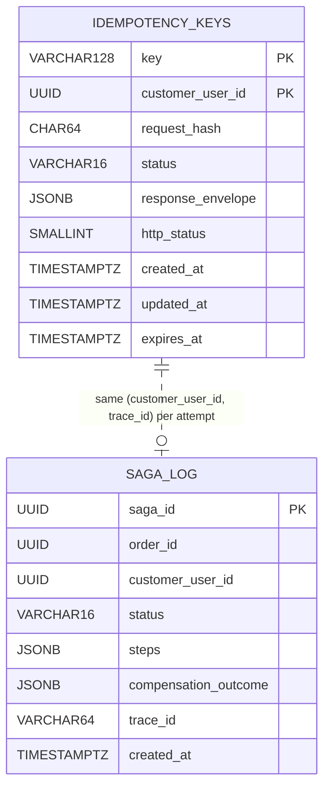

# ERD — Checkout Service

## Schema owner

- Service: `checkout`
- Postgres schema: `checkout`
- Default `search_path`: `checkout, public`
- Tables owned: `idempotency_keys`, `saga_log` (2 tables; no aggregates beyond the orchestrator's bookkeeping).
- Cross-service references (logical only — NEVER FK-enforced; ADR-001 schema-per-service):
  - `idempotency_keys.customer_user_id` → `identity.users.id` (validated only via `claims.sub` on the inbound JWT; never via DB-layer FK)
  - `saga_log.order_id` → `order.orders.id` (the orderId minted at step 5 of `checkout.commit`; never FK-enforced because Order owns that schema)
- **Negative invariant (LOCKED):** Checkout MUST NOT own or write to `orders`, `order_items`, `payment_intents`, `stock_levels`, or `reservations`. Those belong to Order, Payment, and Inventory respectively (ADR-001 + ADR-003). Cross-service joins are forbidden by `cross-cutting.persistence`.

## Aggregate boundaries

This service is a sync HTTP **orchestrator**. It owns no business aggregates — only operational bookkeeping for the 9-step `checkout.commit` flow and the read-only `checkout.preview`. The two tables therefore form a single technical aggregate:

- **CheckoutAttempt** (root: `idempotency_keys.(key, customer_user_id)`) — the one row that pins an `INFLIGHT`/`COMPLETED`/`ABANDONED` outcome for a single customer-supplied `Idempotency-Key`. Each row is durable proof of "exactly one orderId was ever produced for this Idempotency-Key from this customer." The companion `saga_log` row is its postmortem trace.

There is no future split planned. If `checkout.commit` throughput dwarfs read-only `checkout.preview` (very unlikely — preview is cheaper than commit by an order of magnitude), the preview handler could become a sidecar, but the commit path's `idempotency_keys` row would stay anchored here.

## Tables

### `idempotency_keys`

| Column | Type | Null | Default | Comment |
|---|---|---|---|---|
| key | VARCHAR(128) | NOT NULL | — | Customer-supplied opaque string per `cross-cutting.idempotency`; max 128 chars; UUID v4 recommended; regex `^[A-Za-z0-9._:-]{1,128}$`. |
| customer_user_id | UUID | NOT NULL | — | `claims.sub` from the inbound JWT; pins the per-(endpoint, customerUserId) scope so the same key cannot collide across customers. |
| request_hash | CHAR(64) | NOT NULL | — | sha256 hex of the canonicalized request body (sorted keys, normalized whitespace, lowercased hex). EXCLUDES the Authorization header; INCLUDES `shippingAddressId`. |
| status | VARCHAR(16) | NOT NULL | — | enum: `INFLIGHT`, `COMPLETED`, `ABANDONED`. CHECK enforced. |
| response_envelope | JSONB | NULL | — | The full `wrapper.Response` envelope to return on replay. NULL while `status='INFLIGHT'`; required NOT NULL when status moves to COMPLETED/ABANDONED. |
| http_status | SMALLINT | NULL | — | The HTTP status to return on replay (e.g., 201 on success, 400/409/503/504 on decided errors). NULL while INFLIGHT. |
| created_at | TIMESTAMPTZ | NOT NULL | NOW() | Pinned by the atomic INSERT in `TryClaimOrLookup`. |
| updated_at | TIMESTAMPTZ | NOT NULL | NOW() | Bumped on every UPDATE (status transitions, finalize). |
| expires_at | TIMESTAMPTZ | NOT NULL | — | `NOW() + INTERVAL '24 hours'` per `cross-cutting.idempotency.ttl_hours=24` for `checkout.commit`. |

- **Primary key:** `(key, customer_user_id)` — composite. This is THE load-bearing constraint for the `INSERT ... ON CONFLICT (key, customer_user_id) DO NOTHING RETURNING` pattern (`TryClaimOrLookup`). If the PK were `key` alone, two different customers using the same opaque string (e.g., a leaked or guessed UUID) could collide; the composite PK confines the scope to per-customer.
- **Indexes (partial, for janitor cadence):**
  - `idx_idempotency_expires_at ON idempotency_keys (expires_at) WHERE status IN ('COMPLETED','ABANDONED')` — backs the 5-minute TTL janitor that DELETEs rows past their 24h horizon in batches of 500.
  - `idx_idempotency_inflight ON idempotency_keys (created_at) WHERE status='INFLIGHT'` — backs the 60-second stale-INFLIGHT janitor that flips rows to `ABANDONED` once they exceed the 60s open-tx window. The janitor uses `LIMIT 100 FOR UPDATE SKIP LOCKED` so it never blocks a live commit.
- **Constraints:**
  - `CHECK (status IN ('INFLIGHT','COMPLETED','ABANDONED'))`
  - `CHECK (CHAR_LENGTH(request_hash) = 64)` (defensive; sha256 hex is always 64 chars)
- **Owner aggregate:** CheckoutAttempt (root).

### `saga_log`

| Column | Type | Null | Default | Comment |
|---|---|---|---|---|
| saga_id | UUID | NOT NULL | gen_random_uuid() | Surrogate PK; UUID v4 acceptable here because saga_log is operational-only and not reachable on the request path. |
| order_id | UUID | NOT NULL | — | The orderId minted by Checkout at step 5; logical-only FK to `order.orders.id` (NOT enforced). May be the empty UUID for early-fail rows where the run died before step 5. |
| customer_user_id | UUID | NOT NULL | — | `claims.sub`. |
| status | VARCHAR(16) | NOT NULL | — | enum: `COMPLETED`, `COMPENSATED`, `DEGRADED`. CHECK enforced. `DEGRADED` is the load-bearing state for the saga reconciler (REV-L2-008). |
| steps | JSONB | NOT NULL | — | Array of `{step, name, startedAt, endedAt, outcome, httpStatus?}` per orchestration step. Includes failed steps. |
| compensation_outcome | JSONB | NULL | — | Required when `status IN ('COMPENSATED','DEGRADED')`; describes the per-compensation outcome (which retries succeeded, which exhausted, the inner err string). NULL when `status='COMPLETED'`. |
| trace_id | VARCHAR(64) | NOT NULL | — | The W3C traceparent's `trace-id` segment captured from the inbound request. Backs forensic cross-service correlation. |
| created_at | TIMESTAMPTZ | NOT NULL | NOW() | |

- **Primary key:** `saga_id`.
- **Indexes:**
  - `idx_saga_order_id (order_id)` — backs the postmortem lookup-by-orderId workflow.
  - `idx_saga_status_created (status, created_at) WHERE status='DEGRADED'` — partial index that powers the saga-reconciler's 60-second scan + alert metric (REV-L2-008).
- **Constraints:**
  - `CHECK (status IN ('COMPLETED','COMPENSATED','DEGRADED'))`
- **Owner aggregate:** CheckoutAttempt (auxiliary; written once per attempt at step 10 or at any compensation-failure point).
- **Append-only:** Repo exposes `Write` only; no `Update`/`Delete` outside the 90-day TTL janitor.
- **TTL:** Retain 90 days; nightly batch DELETE WHERE `created_at < NOW() - INTERVAL '90 days'`.

## Relationships

```
identity.users (id PK; foreign schema)
   ▲
   │ logical ref via claims.sub
   │ NOT FK-enforced (ADR-001 schema-per-service)
   │
checkout.idempotency_keys
   ┌─ PK (key, customer_user_id)
   └─ status enum drives TryClaimOrLookup branches

checkout.saga_log
   ┌─ PK saga_id
   ├─ order_id  → order.orders.id  (logical only; foreign schema)
   └─ written once per checkout.commit attempt (success or failure path)

(no within-schema FK between idempotency_keys and saga_log — they share customer_user_id + the same trace_id but are written in the same outer tx and correlated by the audit trace)
```



## Invariants

- **Atomic claim:** A row is created ONLY via the single statement `INSERT ... ON CONFLICT (key, customer_user_id) DO NOTHING RETURNING key` (TryClaimOrLookup). The single-statement insert closes the dry-run #1 H02 race window where a `Lookup → InsertInflight` pair could let two concurrent first-time callers both observe NOT FOUND and both proceed to orchestration.
- **One-orderId-per-key invariant:** For any given `(key, customer_user_id)`, at most one orderId is ever returned to the customer. This is the entire point of CHK-009. The PK + the atomic claim + the row lock through step 10 enforce it together.
- **Status monotonicity:**
  - `INFLIGHT → COMPLETED` (success or decided-error path; envelope is final).
  - `INFLIGHT → ABANDONED` (60s stale janitor; replay sees `ABANDONED` and either delete-then-reclaim or surface the cached 504 envelope).
  - `ABANDONED → (deleted)` (replay deletes and re-INSERTs; this is the only legal transition off ABANDONED).
  - `COMPLETED` is terminal (the row only ages out via the 24h TTL janitor; replays are read-only against it).
- **Server-side price authority (CHK-005):** Even though the row stores `request_hash`, the response_envelope's pricing fields are computed from `pricing.go` at step 5 — a client-supplied `total/subtotal/shippingFee` field never enters the hash because request validation rejects them at the request boundary BEFORE TryClaimOrLookup runs. Defense-in-depth.
- **Saga DEGRADED is alertable:** Any `saga_log` row with `status='DEGRADED'` older than 1 hour MUST be surfaced via `checkout_saga_degraded_unreconciled_total` (REV-L2-008). The reservation TTL (15min, `cross-cutting.pricing.constants.RESERVATION_TTL_MINUTES`) is the inventory-side safety net; this metric is the operational visibility net.
- **No cross-service write:** `checkout` schema MUST NOT contain `orders`, `order_items`, `payment_intents`, `stock_levels`, or `reservations` columns by any name. Reviewer-L1 greps the schema dump as a defensive smoke.

## Concurrency model

- **Lock acquisition order:** Single resource per attempt. The atomic INSERT acquires Postgres' unique-index lock on `(key, customer_user_id)`; if it conflicts, the follow-up `SELECT ... FOR UPDATE` blocks on whichever transaction is currently holding the row. There is no multi-row lock-order pin to document — this service holds at most one `idempotency_keys` row per request and does not lock `saga_log` (saga_log is an INSERT-only auxiliary).
- **Optimistic vs pessimistic:** Pessimistic via `FOR UPDATE`. The `idempotency_keys` row lock is held for the entire orchestration (steps 1–10), which is by design: a concurrent call with the same key + same customer must see `INFLIGHT` and be told to retry, not race.
- **Transaction shape:** Single ReadCommitted tx wraps all 10 steps. Downstream HTTP calls happen INSIDE the open tx (the row lock holds INFLIGHT). The downstream services have their own local txs; checkout's tx does NOT span them. saga_log INSERT is in the same outer tx so the (idempotency outcome, saga audit) write is atomic.
- **Compensation calls run on `context.Background()`** so a client-side cancel does not abort an in-flight `inventory.reservation.release` or `order.cancel-on-checkout-failure`. The orchestration tx still commits with the final envelope (DEGRADED if compensation exhausted), so retries get the cached outcome.
- **Hot rows:** None expected. Each row is per-Idempotency-Key, which is per-pending-checkout-attempt — natural high-cardinality partitioning. The hottest contention pattern is a frontend mis-configured to fire two concurrent commits with the same key; that is precisely what `IDEMPOTENCY_KEY_INFLIGHT (Retry-After: 1)` is designed to push back on.

## Migration history

| Migration | Adds | Applied |
|---|---|---|
| `001_create_idempotency_keys.up.sql` | `checkout` schema; `idempotency_keys` table; PK `(key, customer_user_id)`; partial indexes for TTL + stale-INFLIGHT janitors; CHECK constraint on `status`. | initial |
| `002_create_saga_log.up.sql` | `saga_log` table; PK `saga_id`; partial index `idx_saga_status_created` on `(status, created_at) WHERE status='DEGRADED'`; CHECK on `status`. | initial |

Future migrations:
- `003_add_idempotency_keys_request_hash_check.up.sql` (deferred) — add `CHECK (CHAR_LENGTH(request_hash) = 64)` if the per-row defensive check turns out cheap enough; for MVP the hash is always sha256 hex by construction.

## Snapshot vs live-source policy

This service owns no snapshot columns of foreign data. The `response_envelope` JSONB is a snapshot of THIS service's own success/error envelope at the moment status flipped to `COMPLETED`/`ABANDONED`; replays return that envelope verbatim. That is intentional per `cross-cutting.idempotency.behavior.duplicate_same_payload` ("Return the persisted response_envelope verbatim … Do NOT re-execute side-effects."). The `orderId` embedded inside the success envelope is a logical reference to `order.orders.id` (foreign schema); checkout never reads back from Order to refresh it because the orderId is immutable post-creation.

## Operational notes

- **Janitors (background goroutines started in `main.go`):**
  - **TTL janitor:** every 5 minutes, `DELETE FROM checkout.idempotency_keys WHERE expires_at < NOW() AND status IN ('COMPLETED','ABANDONED') LIMIT 500`. Emits `checkout_idempotency_janitor_swept_total`.
  - **Stale-INFLIGHT janitor:** every 60 seconds, `UPDATE … SET status='ABANDONED', response_envelope=<504 UPSTREAM_TIMEOUT envelope>, http_status=504 WHERE key IN (SELECT key FROM idempotency_keys WHERE status='INFLIGHT' AND created_at < NOW() - INTERVAL '60 seconds' LIMIT 100 FOR UPDATE SKIP LOCKED)`. Emits `checkout_idempotency_janitor_swept_total`.
  - **Saga reconciler (REV-L2-008):** every 60 seconds, `SELECT count(*) FROM checkout.saga_log WHERE status='DEGRADED' AND created_at < NOW() - INTERVAL '1 hour'`. Emits `checkout_saga_degraded_unreconciled_total` so on-call sees stuck rows. Also logs the offending `(saga_id, order_id, trace_id)` tuples at WARN.
- **Backups & recovery:** the `idempotency_keys` table is essentially a 24-hour rolling cache of in-flight + recently-decided attempts; a restore from > 24h ago is functionally a no-op because every row would already be expired. The `saga_log` table is the only data that must survive a longer window; nightly logical backups suffice.
- **PII posture:** No PII is stored in this schema. `customer_user_id` is acceptable per `cross-cutting.persistence`. `response_envelope` may include `addressSnapshot` in the success path — Reviewer-L1 should grep for any logged `address_snapshot` field; this schema's logs MUST NOT echo the envelope contents (the structured-log step lines log only `{step, durationMs, outcome}`).

## Change log

| Date | Author | Change |
|---|---|---|
| 2026-05-08 | Tech-Designer (Opus 4.7 1M, dry-run #2) | Initial ERD; documents idempotency_keys + saga_log; pins TryClaimOrLookup atomic-claim invariant (closes dry-run #1 H02); pins composite PK `(key, customer_user_id)`; pins saga reconciler metric for REV-L2-008; declares the `no orders/payment/stock writes` negative invariant per ADR-001 + ADR-003. |
