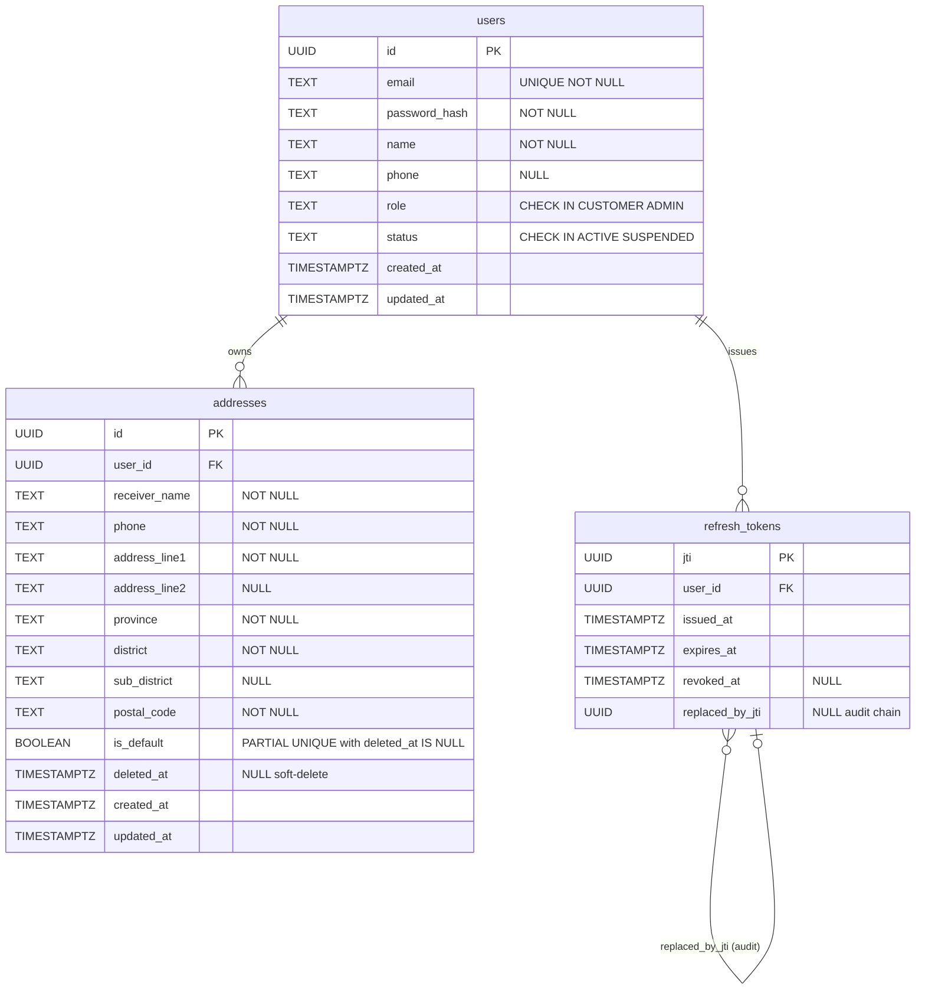

# ERD — Identity Service

## Schema owner

- Service: `identity`
- Postgres schema: `identity`
- Default `search_path`: `identity, public`

## Aggregate boundaries

This service contains three aggregates:

- **User** (root: `users.id`) — the source of truth for customer and admin account data, credentials, and profile information. Owns the login/register lifecycle and profile update.

- **Address** (root: `addresses.id`) — shipping address entries owned by a User. Supports soft-delete semantics and a single-default-per-user invariant enforced by both application logic and a partial UNIQUE index.

- **RefreshToken** (root: `refresh_tokens.jti`) — the revocable refresh-token registry. Enables single-use rotation with a full audit chain (`replaced_by_jti`). No Redis dependency in MVP; Postgres is the revocation store.

Future split considerations: if refresh-token table size exceeds 10M rows with high-write throughput, the RefreshToken aggregate is a candidate for extraction into a dedicated token-management microservice. User and Address aggregates stay together while they share the same `user_id` PK.

## Tables

### `users`

| Column | Type | Null | Default | Comment |
|---|---|---|---|---|
| id | UUID | NOT NULL | gen_random_uuid() | PK; UUID v7 via uuid.NewV7() at insert |
| email | TEXT | NOT NULL | — | RFC5322, max 254; trimmed + lowercased before insert; UNIQUE enforced |
| password_hash | TEXT | NOT NULL | — | bcrypt output; cost 12 + pepper from env BCRYPT_PEPPER; NEVER returned in API responses |
| name | TEXT | NOT NULL | — | Display name; 1–120 chars |
| phone | TEXT | NULL | NULL | Optional; pattern `^[0-9+\- ]{7,20}$` |
| role | TEXT | NOT NULL | 'CUSTOMER' | CHECK IN ('CUSTOMER', 'ADMIN'); always CUSTOMER at self-registration |
| status | TEXT | NOT NULL | 'ACTIVE' | CHECK IN ('ACTIVE', 'SUSPENDED'); SUSPENDED blocks login |
| created_at | TIMESTAMPTZ | NOT NULL | NOW() | |
| updated_at | TIMESTAMPTZ | NOT NULL | NOW() | Bumped on every PATCH profile/update |

**PK:** `id`

**Indexes:**
- `UNIQUE(email)` — deduplication; conflict on 23505 maps to DUPLICATE_EMAIL (HTTP 409)

**Constraints:**
- `CHECK (role IN ('CUSTOMER', 'ADMIN'))`
- `CHECK (status IN ('ACTIVE', 'SUSPENDED'))`

**Owner aggregate:** User.

---

### `addresses`

| Column | Type | Null | Default | Comment |
|---|---|---|---|---|
| id | UUID | NOT NULL | gen_random_uuid() | PK; UUID v7 at insert |
| user_id | UUID | NOT NULL | — | FK → users(id); within-schema FK enforced |
| receiver_name | TEXT | NOT NULL | — | 1–100 chars |
| phone | TEXT | NOT NULL | — | Pattern `^[0-9+\- ]{7,20}$` |
| address_line1 | TEXT | NOT NULL | — | 1–255 chars |
| address_line2 | TEXT | NULL | NULL | Optional; max 255 chars |
| province | TEXT | NOT NULL | — | 1–100 chars |
| district | TEXT | NOT NULL | — | 1–100 chars |
| sub_district | TEXT | NULL | NULL | Optional; max 100 chars |
| postal_code | TEXT | NOT NULL | — | 5-digit string; pattern `^[0-9]{5}$` |
| is_default | BOOLEAN | NOT NULL | false | Single-default invariant enforced by partial UNIQUE index below |
| deleted_at | TIMESTAMPTZ | NULL | NULL | Soft-delete sentinel; NULL = live; non-NULL = deleted. Never hard-deleted. Cleared to false on is_default at soft-delete time. |
| created_at | TIMESTAMPTZ | NOT NULL | NOW() | |
| updated_at | TIMESTAMPTZ | NOT NULL | NOW() | Bumped on PATCH and on soft-delete |

**PK:** `id`

**Indexes:**
- `INDEX(user_id) WHERE deleted_at IS NULL` — fast lookup of live addresses per user
- `UNIQUE(user_id) WHERE is_default = true AND deleted_at IS NULL` — enforces at-most-one default address per user among non-deleted rows; acts as DB-level safety net if application-layer atomic Tx is bypassed

**Constraints:**
- `FK (user_id) REFERENCES users(id)`

**Owner aggregate:** Address.

**Soft-delete note:** `deleted_at` is the only deletion mechanism. `is_default` is explicitly set to `false` on soft-delete so the partial UNIQUE index is not inadvertently violated. Historical orders are unaffected — Order service snapshots address fields at checkout-commit time (no FK cross-service reference).

---

### `refresh_tokens`

| Column | Type | Null | Default | Comment |
|---|---|---|---|---|
| jti | UUID | NOT NULL | — | PK; UUID v4 (per cross-cutting.auth claims spec); the JWT `jti` claim |
| user_id | UUID | NOT NULL | — | FK → users(id); token owner |
| issued_at | TIMESTAMPTZ | NOT NULL | — | Token mint time; mirrors JWT `iat` |
| expires_at | TIMESTAMPTZ | NOT NULL | — | Token expiry; mirrors JWT `exp`; 14 days from issued_at |
| revoked_at | TIMESTAMPTZ | NULL | NULL | Set on logout or refresh-rotation; NULL = still live |
| replaced_by_jti | UUID | NULL | NULL | Audit chain: set to the successor jti during rotation; NULL for login-issued tokens and logout-revoked tokens |

**PK:** `jti`

**Indexes:**
- `INDEX(user_id, expires_at)` — supports future cleanup of expired rows; also useful for listing active sessions

**Constraints:**
- `FK (user_id) REFERENCES users(id)`

**Owner aggregate:** RefreshToken.

**Rotation note:** The atomic refresh-rotation flow (ID-DEC-1) updates `revoked_at` and `replaced_by_jti` in the same UPDATE as inserting the new row, all inside a single pgx Tx. The `replaced_by_jti` column builds a singly-linked audit chain: `jti_n → replaced_by_jti = jti_{n+1} → ...`.

## Relationships

```
users (id PK)
   │
   ├─── FK (user_id) ──────────────► addresses (id PK, user_id, is_default, deleted_at)
   │                                    UNIQUE(user_id) WHERE is_default=true AND deleted_at IS NULL
   │
   └─── FK (user_id) ──────────────► refresh_tokens (jti PK, user_id, revoked_at, replaced_by_jti)
                                         INDEX(user_id, expires_at)
```

Mermaid ER diagram:



**Cross-service note:** The `order` service snapshots address fields at checkout-commit. There is NO cross-service FK from `order.order_addresses` to `identity.addresses`. Cross-service references are by UUID only (schema isolation per `cross-cutting.persistence`).

## Invariants

- **Email uniqueness:** `UNIQUE(email)` on `users` — duplicate email returns 409 DUPLICATE_EMAIL.
- **Password never in response:** `password_hash` is never selected in any API response handler; only used in bcrypt compare.
- **Single default address per user:** `UNIQUE(user_id) WHERE is_default = true AND deleted_at IS NULL` on `addresses` — at most one non-deleted address per user can have `is_default = true`. Enforced at both application layer (atomic Tx in address.create and address.set-default) and DB layer (partial UNIQUE).
- **Soft-delete only:** No `DELETE` statement is ever executed on `addresses`. `deleted_at` is the sole deletion marker. `is_default` is always set to `false` on soft-delete.
- **Refresh-token single-use:** Each `jti` can only be rotated once — `UPDATE ... WHERE revoked_at IS NULL` returning 0 rows means either already rotated or never existed; both produce `AUTH_REVOKED`.
- **Atomic token rotation:** The `UPDATE revoked_at + replaced_by_jti` and `INSERT new row` happen in a single pgx Tx (ID-DEC-1); no window where the old token is revoked but the new one is not yet written.
- **Audit chain integrity:** `replaced_by_jti` is set during rotation only; logout sets `revoked_at` and leaves `replaced_by_jti = NULL`.
- **Role immutability via API:** `role` is set at registration (always `CUSTOMER`) and is not updatable via any customer-facing endpoint (admin seeding is out-of-scope for MVP).

## Concurrency model

- **Users table:** `INSERT` on register — uniqueness enforced by `UNIQUE(email)` index; pgx maps error code 23505 to `DUPLICATE_EMAIL`. `UPDATE` on profile.update — last-writer-wins, no pessimistic locking needed (user updates their own profile; no concurrent writes expected at MVP scale).
- **Addresses table:** `address.create(isDefault=true)` and `address.set-default` open a pgx Tx for the atomic clear-then-set operation. Hot row: the current default address row is updated on every `set-default` call. Contention is low (one user, one session). Partial UNIQUE index provides a DB-level catch-all.
- **Refresh tokens table:** `refresh` endpoint does `UPDATE + INSERT` inside a single Tx. The `UPDATE ... WHERE revoked_at IS NULL` is the concurrency gate — two concurrent refresh calls with the same jti will serialize; the second will see `RowsAffected == 0` and return `AUTH_REVOKED`. This is correct behavior (prevents token re-use under race conditions).
- **No row-level locking (SELECT ... FOR UPDATE) required** for identity operations — the write patterns are user-scoped and do not contend across users. The single exception is refresh-token rotation, where the UPDATE-gate provides sufficient protection without an explicit FOR UPDATE.
- **Expected hot rows:** `refresh_tokens` rows for active users. Index `(user_id, expires_at)` supports future periodic cleanup of expired rows. No sweeper in MVP; expired rows are dormant.

## Migration history

| Migration | Adds | Applied |
|---|---|---|
| `001_users.sql` | `users` table + UNIQUE(email) + CHECK constraints | initial MVP |
| `002_addresses.sql` | `addresses` table + partial INDEX(user_id) WHERE deleted_at IS NULL + partial UNIQUE(user_id) WHERE is_default=true AND deleted_at IS NULL + FK to users | initial MVP |
| `003_refresh_tokens.sql` | `refresh_tokens` table + INDEX(user_id, expires_at) + FK to users | initial MVP |

## Snapshot vs live-source policy

- **No snapshot columns in this service.** All data in `identity` is the live source of truth.
- **Consumers of identity data:** The `order` service snapshots the address fields and `buyerEmail` at checkout-commit time (see `order.order_addresses` and `order.orders.buyerEmailSnapshot`). Those snapshots are frozen at order creation and are independent of any subsequent identity mutations (profile update, address delete, etc.).
- **Why email is not in the JWT claims:** Cross-cutting.auth notes that placing email in the access JWT increases blast radius of token leakage. Checkout fetches it via `identity.profile.read` (Bearer JWT, customer's own context) at commit time.

## Change log

| Date | Author | Change |
|---|---|---|
| 2026-05-08 | Tech-Designer (Sonnet 4.6, dry-run #2) | Initial ERD; three aggregates; partial UNIQUE index on addresses documented; atomic rotation note added; cross-service snapshot policy documented |
