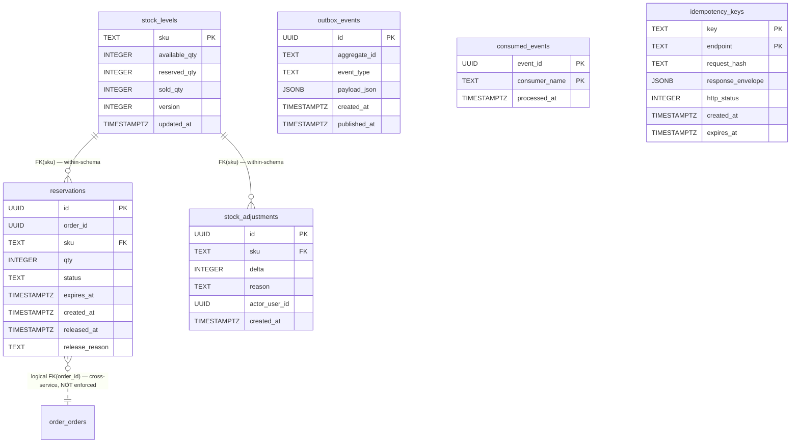

# ERD — Inventory Service

**Owner role:** Tech-Designer · **`template_version`:** 0.1.0 · **`erd_version`:** 0.1.0

Companion to `td.json` in this folder. Pairs with the `tables[]` field in td.json (high-level) — this MD is the full picture: columns, indexes, constraints, relationships, invariants, concurrency model.

---

## Schema owner

- Service: `inventory`
- Postgres schema: `inventory`
- Default `search_path`: `inventory, public`
- Provisioning: per `cross-cutting.persistence.schema_layout` and ADR-001 (schema-per-service). NO cross-service tables, NO cross-service joins, NO DB-enforced cross-service FKs.

## Aggregate boundaries

This service contains two business aggregates plus cross-cutting tables:

- **StockLevel** (root: `stock_levels.sku`) — the source of truth for current quantity per SKU. Owns `stock_levels` and `stock_adjustments`.
- **Reservation** (root: `reservations.id`) — a transient hold on stock, created by Checkout, committed/released by event consumers + the sweeper. Owns `reservations` and `outbox_events` (event-emission for `events.reservation.expired`).
- **Cross-cutting tables** — `consumed_events` (consumer dedup) and `idempotency_keys` (server-side idempotency store) belong to no aggregate; they are infrastructure.

Future-split signal: if reservation throughput exceeds ~1k qps OR sweeper backlog > 10k expired rows / tick, the Reservation aggregate splits into its own microservice; the StockLevel aggregate stays put.

---

## Tables

### `stock_levels`

| Column | Type | Null | Default | Comment |
|---|---|---|---|---|
| `sku` | TEXT | NOT NULL | — | Primary key (matches `catalog.products.sku`) |
| `available_qty` | INTEGER | NOT NULL | `0` | Sellable inventory |
| `reserved_qty` | INTEGER | NOT NULL | `0` | Held by open RESERVED reservations |
| `sold_qty` | INTEGER | NOT NULL | `0` | Committed via `events.payment.completed` consumer |
| `version` | INTEGER | NOT NULL | `0` | Optimistic-lock counter; binding mechanism is FOR UPDATE — version is defensive |
| `updated_at` | TIMESTAMPTZ | NOT NULL | `NOW()` | Set on every UPDATE |

- **Primary key:** `sku`
- **Indexes:** none beyond PK; reads are point-lookups by sku, batch reads use `WHERE sku = ANY($1)`.
- **Constraints:**
  - `CHECK (available_qty >= 0)`
  - `CHECK (reserved_qty >= 0)`
  - `CHECK (sold_qty  >= 0)`
- **Owner aggregate:** StockLevel.

### `reservations`

| Column | Type | Null | Default | Comment |
|---|---|---|---|---|
| `id` | UUID | NOT NULL | — | Primary key (UUID v7, app-generated) |
| `order_id` | UUID | NOT NULL | — | Logical FK to `order.orders.id` (cross-service ref; **NOT enforced** at DB layer per schema isolation) |
| `sku` | TEXT | NOT NULL | — | FK to `stock_levels.sku` (within-schema FK — enforced) |
| `qty` | INTEGER | NOT NULL | — | Reserved units |
| `status` | TEXT | NOT NULL | `'RESERVED'` | Enum: `RESERVED`, `COMMITTED`, `RELEASED`, `EXPIRED` |
| `expires_at` | TIMESTAMPTZ | NOT NULL | — | TTL anchor (`created_at + RESERVATION_TTL_MINUTES`, default 15) |
| `created_at` | TIMESTAMPTZ | NOT NULL | `NOW()` | Wall-clock at insert |
| `released_at` | TIMESTAMPTZ | NULL | NULL | Set when status moves off `RESERVED` |
| `release_reason` | TEXT | NULL | NULL | Enum (when present): `PAYMENT_FAILED`, `PAYMENT_EXPIRED`, `ORDER_CANCELLED`, `ADMIN_FORCE`, `EXPIRED`, `PAID_SOFT_CANCEL` |

- **Primary key:** `id`
- **Indexes:**
  - `INDEX idx_reservations_order_id (order_id)` — drives state-driven event consumers (`SELECT ... WHERE order_id = $1 FOR UPDATE`).
  - `INDEX idx_reservations_sweeper (status, expires_at) WHERE status = 'RESERVED'` — partial index that drives the sweeper SCAN cheaply (only RESERVED rows are candidates).
- **Constraints:**
  - `CHECK (qty > 0)`
  - `CHECK (status IN ('RESERVED','COMMITTED','RELEASED','EXPIRED'))`
  - `FK (sku) REFERENCES stock_levels(sku)`
- **Owner aggregate:** Reservation.

Notes:
- One `order_id` may have multiple rows (one per SKU in the cart). Lookup-by-order is by `order_id`, not by `id`. The `reservationId` returned by `reservation.create` is the first row's `id` (deterministic by `ORDER BY sku ASC`) — informational/audit only.
- `EXPIRED` is written by the sweeper (`release_reason='EXPIRED'`).
- `RELEASED` is written by event-driven release paths (`PAYMENT_FAILED`, `PAYMENT_EXPIRED`, `ORDER_CANCELLED`) and by the HTTP `reservation.release` endpoint (compensation). When the COMMITTED→RELEASED transition is taken (BA PR-006 admin-cancel of PAID order, or PR-003 race resolution), `release_reason='PAID_SOFT_CANCEL'` for grep-friendly audit.

### `stock_adjustments`

| Column | Type | Null | Default | Comment |
|---|---|---|---|---|
| `id` | UUID | NOT NULL | — | Primary key (UUID v7) |
| `sku` | TEXT | NOT NULL | — | FK to `stock_levels.sku` (within-schema) |
| `delta` | INTEGER | NOT NULL | — | Signed; non-zero |
| `reason` | TEXT | NOT NULL | — | 1..255 chars |
| `actor_user_id` | UUID | NOT NULL | — | Admin user id from JWT `claims.sub` |
| `created_at` | TIMESTAMPTZ | NOT NULL | `NOW()` | |

- **Primary key:** `id`
- **Indexes:** `INDEX idx_stock_adjustments_sku (sku, created_at DESC)` — admin "history of this SKU" view.
- **Constraints:**
  - `CHECK (delta <> 0)`
  - `CHECK (length(reason) BETWEEN 1 AND 255)`
  - `FK (sku) REFERENCES stock_levels(sku)`
- **Owner aggregate:** StockLevel.

Notes: INV-007 audit row; written in the same tx as the `stock_levels` UPDATE, so an adjustment row can never exist without its corresponding stock mutation (and vice-versa).

### `outbox_events`

| Column | Type | Null | Default | Comment |
|---|---|---|---|---|
| `id` | UUID | NOT NULL | — | Primary key (UUID v7; also the `eventId` in payload) |
| `aggregate_id` | TEXT | NOT NULL | — | `orderId` for `events.reservation.expired` (= partition key on Kafka) |
| `event_type` | TEXT | NOT NULL | — | E.g. `reservation.expired` |
| `payload_json` | JSONB | NOT NULL | — | Canonicalized event body |
| `created_at` | TIMESTAMPTZ | NOT NULL | `NOW()` | |
| `published_at` | TIMESTAMPTZ | NULL | NULL | Set by relayer on successful Kafka publish |

- **Primary key:** `id`
- **Indexes:** `PARTIAL INDEX idx_outbox_unpublished (id) WHERE published_at IS NULL` — drives the relayer poll cheaply.
- **Owner aggregate:** Reservation (sweeper writes; relayer publishes).

Notes: per ADR-004 + `cross-cutting.persistence.outbox_pattern`. Single-threaded relayer goroutine polls every 5s, `ORDER BY id ASC LIMIT 100`, publishes via `common/kafka` with `key = aggregate_id`, then `UPDATE published_at = NOW()`. At-least-once — consumers (Order) dedup on `payload.eventId` via their own `consumed_events` table.

### `consumed_events`

| Column | Type | Null | Default | Comment |
|---|---|---|---|---|
| `event_id` | UUID | NOT NULL | — | The producer's `payload.eventId` |
| `consumer_name` | TEXT | NOT NULL | — | E.g. `inventory.payment-completed` |
| `processed_at` | TIMESTAMPTZ | NOT NULL | `NOW()` | |

- **Primary key:** `(event_id, consumer_name)` — composite
- **Indexes:** none beyond PK.
- **Owner aggregate:** (cross-cutting consumer dedup)

Notes: each consumer issues `INSERT INTO consumed_events (event_id, consumer_name) VALUES ($1, $2) ON CONFLICT DO NOTHING` inside the same tx that applies the event side-effect. Zero rows-affected ⇒ duplicate (or in-flight retry) ⇒ early-return idempotent no-op. This is layer-1 of the two-layer dedup; layer-2 is the state-driven `SELECT ... FOR UPDATE` per ADR-009.

### `idempotency_keys`

| Column | Type | Null | Default | Comment |
|---|---|---|---|---|
| `key` | TEXT | NOT NULL | — | `= orderId` for `inventory.reservation.create` (per `cross-cutting.idempotency.internal_orderId_rule`) |
| `endpoint` | TEXT | NOT NULL | — | E.g. `inventory.reservation.create` |
| `request_hash` | TEXT | NOT NULL | — | sha256 of canonicalized request body |
| `response_envelope` | JSONB | NOT NULL | — | The exact envelope to replay |
| `http_status` | INTEGER | NOT NULL | — | Replay status code |
| `created_at` | TIMESTAMPTZ | NOT NULL | `NOW()` | |
| `expires_at` | TIMESTAMPTZ | NOT NULL | — | `created_at + 24h` per `cross-cutting.idempotency.server_side_store.ttl` |

- **Primary key:** `(key, endpoint)` — composite
- **Indexes:** `INDEX idx_idem_expires (expires_at)` — backstop GC sweep (out-of-MVP cleanup job).
- **Owner aggregate:** (cross-cutting idempotency)

Notes: `SELECT ... FOR UPDATE` on this row inside the reservation.create tx serializes concurrent same-key callers — second waiter blocks until the first commit then takes the replay branch.

---

## Relationships



ASCII fallback:

```
stock_levels (sku PK)
   ▲
   │ FK (sku) — within-schema, enforced
   │
   ├── reservations         (id PK, order_id, sku FK, qty, status, expires_at, ...)
   │       └── logical FK (order_id) → order.orders.id   ← cross-service; NOT enforced
   │
   └── stock_adjustments    (id PK, sku FK, delta, reason, actor_user_id, ...)

outbox_events       (id PK, aggregate_id, event_type, payload_json, published_at)
consumed_events     (event_id, consumer_name) PK
idempotency_keys    (key, endpoint) PK
```

---

## Invariants

- **No-negative invariant (INV-008):** `available_qty >= 0 AND reserved_qty >= 0 AND sold_qty >= 0` at all times. Enforced at three layers (see Concurrency model below).
- **Conservation of physical inventory:** total physical = `available_qty + reserved_qty + sold_qty` is conserved by every operation:
  - Reserve (RESERVED transition): `available_qty -= qty`, `reserved_qty += qty` (sum unchanged).
  - Commit (RESERVED → COMMITTED via `events.payment.completed`): `reserved_qty -= qty`, `sold_qty += qty` (sum unchanged).
  - Release-from-reserved (RESERVED → RELEASED via failure events / HTTP / sweeper): `reserved_qty -= qty`, `available_qty += qty` (sum unchanged).
  - Release-from-committed (COMMITTED → RELEASED via PR-006 admin-cancel / PR-003 race): `sold_qty -= qty`, `available_qty += qty` (sum unchanged).
  - Admin adjust: `available_qty += delta` (the only operation that changes the conserved sum — by design).
- **Reservation TTL (INV-004):** every `RESERVED` row has `expires_at = created_at + RESERVATION_TTL_MINUTES`. The sweeper enforces termination.
- **Status monotonicity:** `RESERVED` → `{COMMITTED, RELEASED, EXPIRED}`. Terminal states never transition back.
- **Audit-row co-existence:** every `stock_adjustments` row exists in the same tx as the corresponding `stock_levels` UPDATE (no orphan, no missing audit).
- **Sole-write on stock_levels:** only Inventory writes `stock_levels`. Catalog, Order, Cart NEVER write here. (Mirror of ADR-003's order-sole-writer rule, applied to stock.)
- **Outbox single-source for `events.reservation.expired`:** the only producer is `inventory.reservation.sweep-expired`; no other path emits this event.

---

## Concurrency model

This is the load-bearing section for ADR-005 + ADR-009 + INV-008.

### Lock-order pin (canonical, per ADR-005)

**ALWAYS lock `stock_levels(sku)` FIRST, THEN `reservations(id)`** inside any state-mutating transaction.

For multi-SKU calls (reservation.create, reservation.release on a multi-SKU order, order.cancelled consumer on a multi-SKU order):

1. Sort the SKUs in **lexicographic ascending order** (Go: `sort.Slice(items, func(i,j) bool { return items[i].Sku < items[j].Sku })`).
2. `SELECT ... FROM stock_levels WHERE sku = ANY($sortedSkus) ORDER BY sku ASC FOR UPDATE` — single round-trip, but Postgres still acquires individual row locks in the ORDER BY order.
3. Per-SKU validate / mutate in the same `ORDER BY sku ASC` order.
4. Then `INSERT INTO reservations` (or `UPDATE reservations`) per SKU.
5. `COMMIT`.

Single-SKU paths (admin `stock.adjust`, sweeper per-row tx, single-line release) cannot deadlock by construction — but they STILL follow the ordering rule (`stock_levels` FIRST, `reservations` second) to keep one canonical pattern.

### Lock primitives

- `SELECT ... FOR UPDATE` on `stock_levels(sku)` and `reservations(id)` — pessimistic, the binding mechanism.
- `SELECT ... FOR UPDATE SKIP LOCKED` on the sweeper's PHASE-1 candidate scan — lets a horizontally-scaled inventory deployment pick disjoint candidate sets without contention.
- `SELECT ... FOR UPDATE` on `idempotency_keys(key, endpoint)` — serializes concurrent same-key reservation.create calls (waiter takes the replay branch on second try).

### No-negative invariant — three-layer defense

| Layer | Mechanism | Where | Behavior on violation |
|---|---|---|---|
| 1 (tx-level guard) | Handler computes `current.available_qty - requested` under the FOR UPDATE row lock; if negative → ROLLBACK + return 409 | reservation.create per-SKU validation; stock.adjust pre-UPDATE check | 409 INSUFFICIENT_STOCK (with per-item details) or 409 STOCK_NEGATIVE_INVARIANT |
| 2 (Postgres CHECK) | `CHECK (available_qty >= 0 AND reserved_qty >= 0 AND sold_qty >= 0)` on `stock_levels` | Defense in depth — fires only if Layer 1 has a bug | PG error 23514 → mapped to 409 STOCK_NEGATIVE_INVARIANT envelope |
| 3 (optimistic version) | `version += 1` on every mutating UPDATE; mismatch is panic-class | Defensive cross-check; FOR UPDATE serializes writers so this should be unreachable | 500 INTERNAL_ERROR + slog.Error stack trace + alert |

### State-driven event consumers (per ADR-009)

All cross-topic event consumers — `events.payment.{completed,failed,expired}`, `events.order.cancelled` — are state-driven:

```
BEGIN TX
  -- LAYER 1: consumed_events PK dedup
  INSERT INTO consumed_events (event_id, consumer_name) VALUES ($1, $2) ON CONFLICT DO NOTHING
  if zero rows affected → COMMIT; ack (idempotent replay)

  -- LAYER 2: state-driven (ADR-009)
  rows = SELECT * FROM reservations WHERE order_id = $orderId ORDER BY sku ASC FOR UPDATE
  for each r in rows:
      branch on CURRENT r.status (NEVER on event.fromStatus)
      ...
COMMIT
```

The PR-003 race (concurrent customer-cancel + payment-success) is resolved entirely by the layer-2 read: the consumer that lands second sees the actual current status, not what the producer thought the prior status was.

### Hot rows + scaling notes

- **Expected hot rows:** top-selling SKUs (flash-sale items). Per-SKU lock contention is the throughput ceiling for that SKU.
- **Mitigation if needed:** shard a hot SKU across multiple stock-level rows (deferred to v2; not required for MVP).
- **Sweeper horizontal-safety:** `FOR UPDATE SKIP LOCKED` on PHASE-1 lets multiple inventory replicas run sweepers without double-release; the per-row PHASE-2 tx is bounded so one slow row never blocks the whole tick.
- **Outbox relayer:** intentionally single-threaded per service (per ADR-004) to preserve per-aggregate event order at the producer side. Multiple replicas need a leader-election shim (deferred — MVP runs one inventory replica).

---

## Migration history

| Migration | Adds | Applied |
|---|---|---|
| `0001_init_stock_levels.up.sql` | `stock_levels` table + CHECK constraints | initial |
| `0002_init_reservations.up.sql` | `reservations` table + FK(sku) + `idx_reservations_order_id` + partial `idx_reservations_sweeper` | initial |
| `0003_init_stock_adjustments.up.sql` | `stock_adjustments` table + idx + FK(sku) | initial |
| `0004_init_outbox_events.up.sql` | `outbox_events` table + partial `idx_outbox_unpublished` | initial |
| `0005_init_consumed_events.up.sql` | `consumed_events` table with composite PK | initial |
| `0006_init_idempotency_keys.up.sql` | `idempotency_keys` table + `idx_idem_expires` | initial |

All migrations are applied at boot when `MIGRATIONS_AUTO_APPLY=true` (local/dev); manual `golang-migrate up` in UAT/PROD.

---

## Snapshot vs live-source policy

This service owns **no snapshot columns** — every column is the live source-of-truth for stock state.

Compare to:
- `order.order_items.priceSnapshot` — IS a snapshot (frozen at checkout.commit-time from Catalog's live price); see Order ERD.
- `order.order_items.productNameSnapshot`, `order.order_items.productImageUrlSnapshot` — same.

Inventory's `stock_levels` columns are deliberately mutable in real time so the catalog's `inStock` filter and cart's `availableQty` checks reflect current state.

`reservations.qty` is the original reserved count — it does NOT mutate after RESERVED is set. State transitions move the row through `RESERVED` → `{COMMITTED, RELEASED, EXPIRED}` but the original `qty` is the audit anchor.

---

## Cross-references

- ADR-001 — schema-per-service (no cross-service tables).
- ADR-003 — order is sole writer of `order.status` (mirror of inventory's sole-writer-of-stock_levels rule).
- ADR-004 — outbox pattern for `events.reservation.expired`.
- ADR-005 — inventory lock-order pin (THIS service's defining concurrency rule).
- ADR-008 — `INTERNAL_SHARED_SECRET` env-var name + constant-time compare on internal HTTP routes.
- ADR-009 — state-driven event consumers (drives the layer-2 dedup + the PR-003 race resolution).
- `cross-cutting.persistence.concurrency` — the row-lock + CHECK + version belt-and-suspenders.
- `cross-cutting.pricing.constants.RESERVATION_TTL_MINUTES` (= 15) — sweeper TTL anchor.
- `events.reservation.expired` — the one event this service produces (consumed by Order).

## Change log

| Date | Author | Change |
|---|---|---|
| 2026-05-08 | Tech-Designer (Opus 4.7 1M) | Initial ERD; lock-order pin documented per ADR-005; state-driven consumer rule per ADR-009; six tables across StockLevel + Reservation aggregates plus three cross-cutting tables. |
