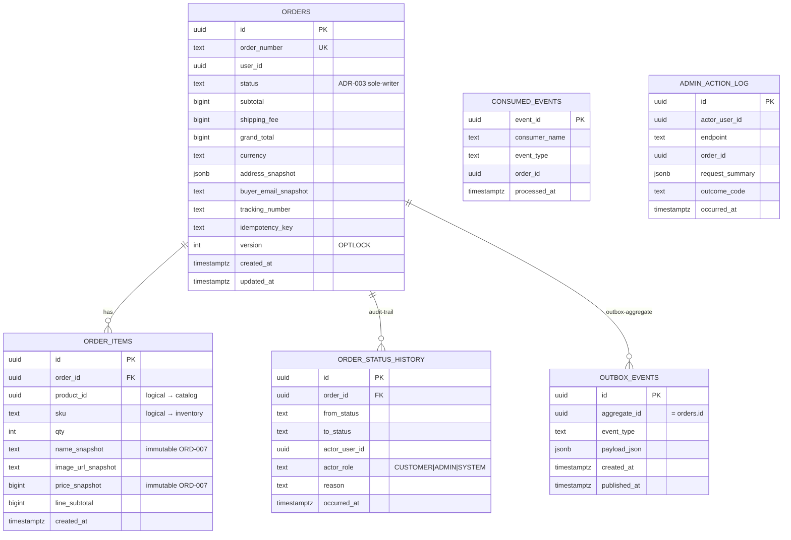

# ERD — Order Service

## Schema owner

- Service: `order`
- Postgres schema: `order`
- Default `search_path`: `order, public`
- Tables owned: `orders`, `order_items`, `order_status_history`, `outbox_events`, `consumed_events`, `admin_action_log` (6 tables) + the global sequence `order_number_seq`.
- Cross-service references (logical only — NEVER FK-enforced; ADR-001 schema-per-service):
  - `orders.user_id` -> `identity.users.id` (logical, validated only via JWT claims at the boundary)
  - `orders.id` -> referenced by `inventory.reservations.order_id` and `payment.payment_intents.order_id` (their concern, not ours)

## Aggregate boundaries

This service contains ONE aggregate:

- **Order** (root: `orders.id`) — the durable record of a sale. Carries the §9.2 state machine, immutable price/name/image snapshots, append-only status history, and the outbox row for `events.order.cancelled`.

Inside the Order aggregate:

- `orders` is the aggregate root; `orders.status` is the LOCKED sole-writer field (ADR-003).
- `order_items` is a child entity; ORD-007 makes the snapshot fields (price/name/image) immutable so that a later catalog soft-delete or price change does not retro-rewrite history.
- `order_status_history` is the audit projection of every `orders.status` write (ORD-009). Append-only.
- `outbox_events` is the per-aggregate outbox table (ADR-004); writes are atomic-with the status mutation.
- `consumed_events` is the per-service inbound dedup table (ADR-009); written by the four event consumers.
- `admin_action_log` is a local audit log for admin endpoints (Reviewer-L1 quality bar; the standalone audit service is out_of_scope).

Future split: if event-consumer throughput dwarfs the customer/admin write path, the consumer + outbox publisher could move to a sidecar service that still calls into the same `service/order_lifecycle` package (sole-writer remains intact). Not needed in MVP.

## Tables

### `orders`

| Column | Type | Null | Default | Comment |
|---|---|---|---|---|
| id | UUID | NOT NULL | — | PK; **client-supplied** UUID v7 by Checkout (cross-cutting.idempotency.internal_orderId_rule). Recipient does NOT generate this. |
| order_number | TEXT | NOT NULL | — | UNIQUE; ORD-YYYYMMDD-NNNNNN; allocated server-side at create-from-checkout via `order_number_seq` (ORD-008). |
| user_id | UUID | NOT NULL | — | Owner; supplied as `customerUserId` from Checkout's claims.sub. |
| status | TEXT | NOT NULL | — | enum: PENDING_PAYMENT, PAID, PAYMENT_FAILED, PAYMENT_EXPIRED, PACKING, SHIPPED, DELIVERED, CANCELLED. **ADR-003 sole-writer field** — only `service/order_lifecycle` writes this. |
| subtotal | BIGINT | NOT NULL | — | THB whole-integer; snapshot at commit; immutable. |
| shipping_fee | BIGINT | NOT NULL | — | THB; cross-cutting.pricing tier (1500 inclusive boundary). |
| coupon_discount | BIGINT | NOT NULL | 0 | Reserved; CHECK = 0 in MVP (coupon engine out_of_scope). |
| grand_total | BIGINT | NOT NULL | — | = subtotal + shipping_fee - coupon_discount. |
| currency | TEXT | NOT NULL | 'THB' | CHECK = 'THB' in MVP. |
| address_snapshot | JSONB | NOT NULL | — | `{addressId, receiverName, phone, addressLine, province, district, postalCode}`. ORD-007 immutable. |
| buyer_email_snapshot | TEXT | NOT NULL | — | Per-order; sourced via Checkout from identity.profile.read step 2 (REV-L2-001 fix). Backs admin search-by-email. |
| tracking_number | TEXT | NULL | — | Set on PACKING->SHIPPED transition (ORD-006). NULL until SHIPPED. |
| idempotency_key | TEXT | NULL | — | Equals Idempotency-Key == orders.id; replay correlation. |
| version | INT | NOT NULL | 0 | OPTLOCK; bumped on every UPDATE. |
| created_at | TIMESTAMPTZ | NOT NULL | NOW() | |
| updated_at | TIMESTAMPTZ | NOT NULL | NOW() | Bumped on every UPDATE. |

- **PK:** `id`
- **Indexes:**
  - `idx_orders_user_id_created_at_desc (user_id, created_at DESC)` — backs `order.list-mine`.
  - `idx_orders_status_created_at_desc (status, created_at DESC)` — backs `order.list-admin` status filter.
  - `idx_orders_order_number` UNIQUE on `order_number` — backs `order.list-admin` search-by-orderNumber prefix.
  - `idx_orders_buyer_email_lower (LOWER(buyer_email_snapshot))` — backs `order.list-admin` case-insensitive search-by-email.
- **Constraints:**
  - `CHECK (status IN ('PENDING_PAYMENT','PAID','PAYMENT_FAILED','PAYMENT_EXPIRED','PACKING','SHIPPED','DELIVERED','CANCELLED'))`
  - `CHECK (subtotal >= 0 AND shipping_fee >= 0 AND grand_total >= 0)`
  - `CHECK (coupon_discount = 0)` (defensive; coupon out_of_scope)
  - `CHECK (currency = 'THB')`
- **Owner aggregate:** Order (root).

### `order_items`

| Column | Type | Null | Default | Comment |
|---|---|---|---|---|
| id | UUID | NOT NULL | uuid_generate_v7() | PK |
| order_id | UUID | NOT NULL | — | FK -> orders.id ON DELETE RESTRICT |
| product_id | UUID | NOT NULL | — | logical FK to catalog.products.id (NOT enforced — schema isolation). |
| sku | TEXT | NOT NULL | — | logical FK to inventory.stock_levels.sku (NOT enforced). |
| qty | INT | NOT NULL | — | CHECK > 0 |
| name_snapshot | TEXT | NOT NULL | — | Frozen at commit (ORD-007 + CAT-009). |
| image_url_snapshot | TEXT | NULL | — | Frozen at commit; NULL acceptable. |
| price_snapshot | BIGINT | NOT NULL | — | Whole-THB; CHECK >= 0 (ORD-007 immutable). |
| line_subtotal | BIGINT | NOT NULL | — | = price_snapshot * qty; persisted; CHECK >= 0. |
| created_at | TIMESTAMPTZ | NOT NULL | NOW() | |

- **PK:** `id`
- **Indexes:** `INDEX(order_id)` — backs `order.detail` JOIN.
- **Constraints:** `CHECK (qty > 0)`, `CHECK (price_snapshot >= 0)`, `CHECK (line_subtotal >= 0)`, `FK (order_id) REFERENCES orders(id) ON DELETE RESTRICT`.
- **Immutability:** Repo layer exposes NO Update method (ORD-007). Defensive Postgres trigger on UPDATE/DELETE raises `'order_items rows are immutable per ORD-007'` (deferred to MVP+1; repo discipline + code review covers MVP).
- **Owner aggregate:** Order.

### `order_status_history`

| Column | Type | Null | Default | Comment |
|---|---|---|---|---|
| id | UUID | NOT NULL | uuid_generate_v7() | PK |
| order_id | UUID | NOT NULL | — | FK -> orders.id |
| from_status | TEXT | NULL | — | NULL only for the initial PENDING_PAYMENT row. |
| to_status | TEXT | NOT NULL | — | |
| actor_user_id | UUID | NULL | — | NULL when actor_role='SYSTEM'. |
| actor_role | TEXT | NOT NULL | — | enum: CUSTOMER, ADMIN, SYSTEM. |
| reason | TEXT | NULL | — | Required by app logic when to_status='CANCELLED' OR for SYSTEM transitions where origin event id is recorded. |
| occurred_at | TIMESTAMPTZ | NOT NULL | NOW() | |

- **PK:** `id`
- **Indexes:** `idx_order_status_history_order_occurred (order_id, occurred_at ASC)` — backs `order.detail.statusHistory` ordering.
- **Constraints:** `CHECK (actor_role IN ('CUSTOMER','ADMIN','SYSTEM'))`, `FK (order_id) REFERENCES orders(id)`.
- **Append-only:** Repo exposes Insert + ListByOrderIdAsc only; NO Update/Delete (ORD-009).
- **Owner aggregate:** Order.

### `outbox_events`

| Column | Type | Null | Default | Comment |
|---|---|---|---|---|
| id | UUID | NOT NULL | — | PK; UUID v7; doubles as event_id in the published payload. |
| aggregate_id | UUID | NOT NULL | — | = orders.id; Kafka partition key. |
| event_type | TEXT | NOT NULL | — | 'order.cancelled' (consumed) or 'order.created' (audit-only; no consumer in MVP). |
| payload_json | JSONB | NOT NULL | — | Conforms to events.order.cancelled.payload for cancel events. |
| created_at | TIMESTAMPTZ | NOT NULL | NOW() | |
| published_at | TIMESTAMPTZ | NULL | — | NULL until publisher goroutine sends. |

- **PK:** `id`
- **Indexes:** `outbox_events_pending (id) WHERE published_at IS NULL` — partial index for the publisher polling query (ADR-004).
- **Owner aggregate:** Order.

### `consumed_events`

| Column | Type | Null | Default | Comment |
|---|---|---|---|---|
| event_id | UUID | NOT NULL | — | PK; conflict on insert = duplicate (Kafka redelivery dedup). |
| consumer_name | TEXT | NOT NULL | — | e.g. 'order.payment.completed'. |
| event_type | TEXT | NOT NULL | — | |
| order_id | UUID | NOT NULL | — | for debug/forensics. |
| processed_at | TIMESTAMPTZ | NOT NULL | NOW() | |

- **PK:** `event_id`
- **Indexes:** `idx_consumed_events_order_id (order_id)`.
- **Insertion semantics:** `INSERT ... ON CONFLICT (event_id) DO NOTHING RETURNING event_id` — consumer treats no-row as 'already processed' and acks (ADR-009).
- **Owner aggregate:** Order.

### `admin_action_log`

| Column | Type | Null | Default | Comment |
|---|---|---|---|---|
| id | UUID | NOT NULL | uuid_generate_v7() | PK |
| actor_user_id | UUID | NOT NULL | — | claims.sub of the admin caller. |
| endpoint | TEXT | NOT NULL | — | e.g. 'order.update-status-admin'. |
| order_id | UUID | NULL | — | NULL for endpoints not tied to a specific order (list-admin). |
| request_summary | JSONB | NOT NULL | — | `{toStatus?, trackingNumber?, reason?, filters?}` — never the JWT or auth header. |
| outcome_code | TEXT | NOT NULL | — | From cross-cutting.error-codes registry. |
| occurred_at | TIMESTAMPTZ | NOT NULL | NOW() | |

- **PK:** `id`
- **Indexes:** `idx_admin_action_log_order_occurred (order_id, occurred_at DESC) WHERE order_id IS NOT NULL`.
- **Owner aggregate:** Order (audit projection — written even on rejection paths so the audit log is complete).

### `order_number_seq` (sequence, not table)

```sql
CREATE SEQUENCE order_number_seq START 1 INCREMENT 1 NO CYCLE;
```

Usage: `SELECT nextval('order_number_seq')` inside `order.create-from-checkout` tx. Format `ORD-YYYYMMDD-NNNNNN` via `fmt.Sprintf("ORD-%s-%06d", time.Now().UTC().Format("20060102"), seq)`. ORD-008.

## Relationships

```
                        identity.users (foreign schema; logical only)
                              │
                              │ logical-FK (user_id) — JWT-mediated; NOT enforced
                              ▼
                          orders (id PK, order_number UNIQUE, status SOLE-WRITER)
                              ▲
                              │ FK (order_id) ON DELETE RESTRICT
                              │
                       ┌──────┴────────┬───────────────┬──────────────┐
                       │               │               │              │
                  order_items   order_status_history outbox_events  admin_action_log
                  (immutable    (append-only           (atomic        (audit log;
                   snapshots)    audit; ORD-009)        with status    written even on
                                                       UPDATE)         rejection)

                          consumed_events (PK on event_id; ADR-009 dedup)
                          — no FK to orders; references by orderId for forensics only

                          order_number_seq (global sequence; ORD-008)
                          — used at create-from-checkout time; NOT a table.
```



## Invariants

- **Sole-writer of `orders.status`:** ADR-003 — only `app/order/access/storage_orders.go::UpdateStatus` (and the initial INSERT in `service/order_creator.go`) ever writes the column. Enforced by code-review + a grep in CI for `UPDATE orders.*status` outside that file. Comment `// ADR-003 sole-writer of orders.status` lives at every UPDATE.
- **State machine:** `orders.status` transitions only along the 14 rows of `state_machine.allowed_transitions` (td.json). Any other transition returns 409 INVALID_ORDER_STATE. Enforced by `domain/transitions.ValidateTransition` called inside the FOR UPDATE tx of every status mutator.
- **Concurrency:** every status mutation acquires `SELECT * FROM orders WHERE id=$1 FOR UPDATE` before validating + writing. The `version` column is bumped on every UPDATE as a defensive belt-and-suspenders alongside the row lock (cross-cutting.persistence.concurrency).
- **ORD-007 immutability:** `order_items` snapshot fields (`name_snapshot`, `image_url_snapshot`, `price_snapshot`, `line_subtotal`, `qty`) and `orders.address_snapshot` / `orders.subtotal` / `orders.shipping_fee` / `orders.grand_total` are FROZEN at create-from-checkout; the repo exposes no Update path for `order_items`. A defensive UPDATE/DELETE trigger is queued for MVP+1.
- **ORD-009 append-only audit:** every `orders.status` write writes a sibling `order_status_history` row in the same tx. Enforced at the service layer (single canonical mutator path).
- **ORD-008 order number format:** `order_number` matches `ORD-YYYYMMDD-NNNNNN` and is UNIQUE. Allocated server-side via `order_number_seq` inside the create-from-checkout tx.
- **Outbox atomicity:** when emitting `events.order.cancelled`, the `outbox_events` INSERT is in the SAME tx as the `orders` UPDATE and the `order_status_history` INSERT — so the trio commits atomically (ADR-004).
- **Consumer dedup:** every inbound event (4 consumers) inserts into `consumed_events` first; ON CONFLICT DO NOTHING absorbs Kafka at-least-once redelivery. State-driven guards inside FOR UPDATE absorb cross-topic interleavings (ADR-009).
- **Customer-scoped reads:** `order.list-mine` and `order.detail` (CUSTOMER actor) and `order.cancel-mine` ALL filter `WHERE user_id = claims.sub`. Misses return 404 ORDER_NOT_OWNED — never 403, never the order body (ORD-001 no-existence-leak).
- **Buyer-email snapshot:** `orders.buyer_email_snapshot` is the canonical search index for admin email-search; sourced via Checkout from identity.profile.read in checkout.commit step 2 (REV-L2-001 fix). Per-order, NOT denormalized to `order_items` (Plan-Reviewer PR-002 advisory).
- **CHECK enforcement:** `subtotal >= 0`, `shipping_fee >= 0`, `grand_total >= 0`, `qty > 0`, `price_snapshot >= 0`, `coupon_discount = 0`, `currency = 'THB'`, `status` ∈ enum, `actor_role` ∈ enum.

## Concurrency model

- **Locking pattern:** PESSIMISTIC via `SELECT ... FOR UPDATE` on the `orders` row inside every transition tx (customer / admin / event-driven). The OPTLOCK `version` column is a defensive secondary check.
- **Lock order:** Order's tables are not multi-row locked — every transition touches exactly one `orders` row + one `order_status_history` INSERT + (maybe) one `outbox_events` INSERT + (maybe) one `admin_action_log` INSERT. No multi-row lock = no deadlock potential within Order's schema. (Compare inventory ADR-005 which DOES need a documented lock-order for multi-SKU reservations.)
- **Hot rows:** the `orders` row for a single order is hot during the brief checkout window (create -> payment-completed/failed/expired) and during admin status walks. Per-order qps is naturally low (a single order receives at most one event per path), so contention is bounded.
- **Cross-topic race resolution (PR-003 + PR-008):** the FOR UPDATE row lock + state-driven consumer (ADR-009) jointly serialize cross-topic interleavings. First-writer-wins: the first event to acquire the row lock observes status='PENDING_PAYMENT' and transitions; the second observes the new state and falls into the no-op log branch.
- **Outbox publisher:** SINGLE-threaded per pod (ADR-004) so per-aggregate ordering is preserved at the producer side. ORDER BY id ASC; LIMIT 100 per tick; panic-recovery so one bad row doesn't kill the loop.
- **Kafka consumer:** consumer-group `order-svc`; subscribes to `ecom.payment.events` (3 event types) + `ecom.inventory.events` (1 event type). Consumer-side dedup via `consumed_events` PK; state-driven transitions inside FOR UPDATE.

## Migration history

| Migration | Adds | Applied |
|---|---|---|
| `001_orders.up.sql` | `orders` table + indexes + CHECK constraints | initial |
| `002_order_items.up.sql` | `order_items` table + indexes + FK | initial |
| `003_order_status_history.up.sql` | `order_status_history` table + index | initial |
| `004_outbox_events.up.sql` | `outbox_events` + partial pending index (ADR-004) | initial |
| `005_consumed_events.up.sql` | `consumed_events` + index (ADR-009) | initial |
| `006_admin_action_log.up.sql` | `admin_action_log` + partial index | initial |
| `007_order_number_seq.up.sql` | `CREATE SEQUENCE order_number_seq` (ORD-008) | initial |

## Snapshot vs live-source policy

This service stores SEVEN snapshot columns; all are frozen at `order.create-from-checkout` time and immutable thereafter (ORD-007).

| Column | Source service | Why snapshotted | Refresh policy |
|---|---|---|---|
| `orders.address_snapshot` (JSONB) | identity.address | The customer may delete or rewrite the address after the order; the order detail must keep the address that shipped. | NEVER refreshed. |
| `orders.buyer_email_snapshot` | identity.profile | Admin search-by-email must continue to work after a profile email change. Sourced via Checkout from identity.profile.read step 2 (REV-L2-001 fix). | NEVER refreshed. |
| `orders.subtotal` / `orders.shipping_fee` / `orders.grand_total` | computed by Checkout (cross-cutting.pricing) | Catalog price may change; cart's view of price is purely informational; the order locks in the price the customer accepted. | NEVER refreshed. |
| `order_items.name_snapshot` | catalog.products.name | Catalog product may be soft-deleted (CAT-009) or renamed; the order detail must still show what the customer bought. | NEVER refreshed. |
| `order_items.image_url_snapshot` | catalog.products.image_url | Same as name; product image may be replaced or removed. | NEVER refreshed. |
| `order_items.price_snapshot` | catalog.products.price | Same as subtotal; locks the price at checkout. | NEVER refreshed. |
| `order_items.line_subtotal` | computed (price_snapshot * qty) | Persisted to defend against arithmetic drift across replays/code changes. | NEVER refreshed. |

Compare:
- `inventory.stock_levels` (foreign schema) — LIVE source-of-truth; never snapshotted by Order. The reservation is a separate aggregate in Inventory.
- `payment.payment_intents` (foreign schema) — LIVE; Order references the orderId in its outbox payloads but does not persist payment state.

## Cross-service reference rules

- `orders.user_id` -> `identity.users.id`: logical reference only; NEVER FK-enforced (ADR-001 schema isolation). Validity is ensured by the JWT claim flow at the boundary.
- `orders.id` is referenced by `inventory.reservations.order_id` and `payment.payment_intents.order_id`: those are foreign-schema concerns; not modeled here.
- `order_items.product_id` and `order_items.sku`: logical references to `catalog.products.id` / `inventory.stock_levels.sku` for forensics; NOT FK-enforced. Snapshot fields cover the hard requirement.

## Change log

| Date | Author | Change |
|---|---|---|
| 2026-05-08 | Tech-Designer (Opus 4.7 1M, dry-run #2) | Initial ERD; sole-writer invariant + state-machine + outbox + consumed_events + buyer_email_snapshot per ORDER (PR-002 advisory) + admin_action_log + order_number_seq. ADR-003/004/008/009 cross-referenced at every relevant invariant. |
