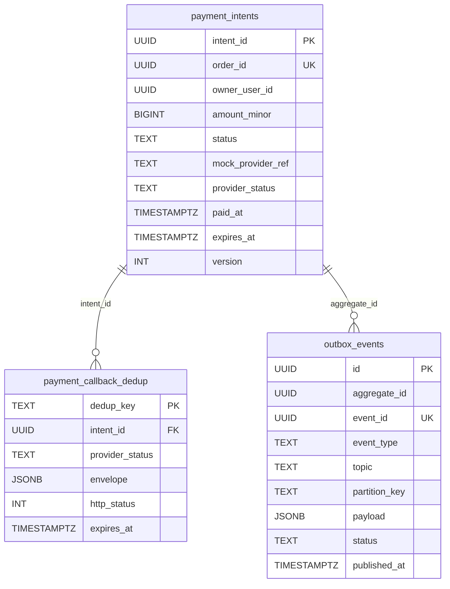

# ERD — Payment Service

## Schema owner

- Service: `payment`
- Postgres schema: `payment`
- Default `search_path`: `payment, public`

## Aggregate boundaries

This service contains a single root aggregate plus two supporting tables:

- **PaymentIntent** (root: `payment_intents.intent_id`) — one row per order; the state machine owner. Status transitions: `REQUIRES_PAYMENT -> {SUCCEEDED, FAILED, EXPIRED}`. Sole writer of `payment_intents`. Cached `owner_user_id` enables payment.simulate ownership check without a sync hop to identity/order.
- **CallbackDedup** (`payment_callback_dedup.dedup_key`) — supporting table that absorbs webhook redeliveries; one row per resolved (intentId, providerStatus) pair. NOT a root aggregate; lifecycle is bound to PaymentIntent.
- **Outbox** (`outbox_events.id`) — transactional outbox for events.payment.completed and events.payment.failed. Drained by the in-process `outbox_relay` goroutine (ADR-004).

This service does NOT contain Order or Inventory aggregate state — Payment NEVER writes orders or stock_levels (ADR-003: Order is sole writer of order.status; Inventory is sole writer of stock_levels and reservations).

## Tables

### `payment_intents`

| Column | Type | Null | Default | Comment |
|---|---|---|---|---|
| intent_id | UUID | NOT NULL | — | PK; UUID v7 generated server-side |
| order_id | UUID | NOT NULL | — | UNIQUE; cross-service ref to order.orders.id (NOT FK-enforced — schema isolation per ADR-001) |
| owner_user_id | UUID | NOT NULL | — | Cached from Checkout's identity.profile.read at create time; backs payment.simulate ownership check |
| amount_minor | BIGINT | NOT NULL | — | THB minor units (satang); CHECK > 0 |
| currency | CHAR(3) | NOT NULL | `'THB'` | MVP supports THB only |
| status | TEXT | NOT NULL | `'REQUIRES_PAYMENT'` | enum via CHECK (see constraints) |
| mock_provider_ref | TEXT | NULL | NULL | First populated by process_callback Step 6; MAX length 64 |
| provider_status | TEXT | NULL | NULL | Raw provider enum echo; populated by process_callback Step 6 |
| paid_at | TIMESTAMPTZ | NULL | NULL | Populated only when status = SUCCEEDED |
| expires_at | TIMESTAMPTZ | NOT NULL | `NOW() + INTERVAL '15 minutes'` | Matches reservation TTL; backs expiry_sweeper |
| version | INT | NOT NULL | 0 | OPTLOCK counter; incremented on every UPDATE |
| created_at | TIMESTAMPTZ | NOT NULL | `NOW()` | |
| updated_at | TIMESTAMPTZ | NOT NULL | `NOW()` | Bumped by every UPDATE |

- **PK:** `intent_id`
- **Indexes:**
  - `UNIQUE (order_id)` — enforces one intent per order; backs payment.intent.create idempotency on `orderId`.
  - `INDEX (status, expires_at) WHERE status = 'REQUIRES_PAYMENT'` — partial index backing the `expiry_sweeper` scan.
  - `INDEX (owner_user_id)` — supports operational queries (admin dashboard); not on the hot path.
- **Constraints:**
  - `CHECK (amount_minor > 0)`
  - `CHECK (currency = 'THB')` — MVP-only; loosen for multi-currency in v2.
  - `CHECK (status IN ('REQUIRES_PAYMENT','SUCCEEDED','FAILED','EXPIRED'))`
  - `CHECK ((status = 'SUCCEEDED') = (paid_at IS NOT NULL))` — paid_at populated iff status = SUCCEEDED.
- **Owner aggregate:** PaymentIntent.

### `payment_callback_dedup`

| Column | Type | Null | Default | Comment |
|---|---|---|---|---|
| dedup_key | TEXT | NOT NULL | — | PK; value = `sha256(intent_id::text \|\| '\|' \|\| provider_status)`. Server-recorded fields ONLY — no user-controlled body fields participate. |
| intent_id | UUID | NOT NULL | — | FK -> `payment_intents(intent_id)` (within-schema FK enforced) |
| provider_status | TEXT | NOT NULL | — | enum SUCCEEDED \| FAILED \| EXPIRED |
| envelope | JSONB | NOT NULL | — | The exact response envelope returned to the original caller: `{code, message, data, traceId}` per cross-cutting.response-envelope |
| http_status | INT | NOT NULL | — | The HTTP status returned alongside the envelope (200 \| 409) |
| created_at | TIMESTAMPTZ | NOT NULL | `NOW()` | |
| expires_at | TIMESTAMPTZ | NOT NULL | `NOW() + INTERVAL '30 days'` | Matches cross-cutting.idempotency window for payment.callback (ADR-006); cleanup is a future-iteration concern |

- **PK:** `dedup_key` (TEXT) — the unique-constraint violation on insert is what makes replay detection work in process_callback Step 4.
- **Indexes:**
  - `INDEX (intent_id)` — supports forensic lookups: "show me every callback envelope for this intent".
  - `INDEX (expires_at)` — backs future retention sweep.
- **Constraints:**
  - `CHECK (provider_status IN ('SUCCEEDED','FAILED','EXPIRED'))`
  - `CHECK (http_status IN (200, 409))` — only the two response shapes ever cached.
  - `FK (intent_id) REFERENCES payment_intents(intent_id)` — within-schema, enforced.
- **Owner aggregate:** CallbackDedup (supporting; bound to PaymentIntent lifecycle).

### `outbox_events`

| Column | Type | Null | Default | Comment |
|---|---|---|---|---|
| id | UUID | NOT NULL | — | PK; UUID v7 (roughly time-ordered) |
| aggregate_type | TEXT | NOT NULL | — | const `'payment_intent'` |
| aggregate_id | UUID | NOT NULL | — | = `payment_intents.intent_id` |
| event_id | UUID | NOT NULL | — | UNIQUE; UUID v7; written into the event payload header for consumer-side dedup via `consumed_events` |
| event_type | TEXT | NOT NULL | — | enum payment.completed \| payment.failed \| payment.expired (last reserved for future) |
| topic | TEXT | NOT NULL | `'ecom.payment.events'` | Kafka topic |
| partition_key | TEXT | NOT NULL | — | = `payment_intents.order_id` so per-orderId ordering is preserved within `ecom.payment.events` |
| payload | JSONB | NOT NULL | — | Matches events.payment.* contract payload |
| status | TEXT | NOT NULL | `'PENDING'` | enum PENDING \| PUBLISHED \| FAILED |
| created_at | TIMESTAMPTZ | NOT NULL | `NOW()` | |
| published_at | TIMESTAMPTZ | NULL | NULL | Set by `outbox_relay` after Kafka producer ACK |
| attempts | INT | NOT NULL | 0 | Incremented by `outbox_relay` on each publish attempt |
| last_error | TEXT | NULL | NULL | Last Kafka error message; cleared on success |

- **PK:** `id`
- **Indexes:**
  - `INDEX (published_at) WHERE published_at IS NULL` — partial index; backs the `outbox_relay` scan (ADR-004 pattern).
  - `UNIQUE (event_id)` — defense against double-emission.
- **Constraints:**
  - `CHECK (event_type IN ('payment.completed','payment.failed','payment.expired'))`
  - `CHECK (status IN ('PENDING','PUBLISHED','FAILED'))`
  - `CHECK (topic = 'ecom.payment.events')` — pin per ADR-004 + cross-cutting topic owner.
- **Owner aggregate:** Outbox (supporting; bound to PaymentIntent lifecycle).

## Relationships

```
payment_intents (intent_id PK, order_id UNIQUE, owner_user_id)
   |
   |--- FK (intent_id)
   v
payment_callback_dedup (dedup_key PK, intent_id, provider_status)

payment_intents (intent_id PK)
   |
   |--- aggregate_id (logical ref; NOT FK)
   v
outbox_events (id PK, aggregate_id, event_id UNIQUE)

payment_intents.order_id ---- logical-FK --> order.orders.id
                                           (cross-schema; NOT enforced; ADR-001 schema isolation)
payment_intents.owner_user_id - logical-FK --> identity.users.id
                                            (cross-schema; NOT enforced)
```



## Invariants

- **One intent per order:** `UNIQUE (order_id)` on `payment_intents`. payment.intent.create idempotency relies on this.
- **Status monotonicity:** `REQUIRES_PAYMENT -> {SUCCEEDED, FAILED, EXPIRED}` is one-way. Terminal states never transition back. Enforced at the handler layer (`process_callback` Step 5 terminal-state guard) AND at the data layer via `CHECK` on status.
- **paid_at iff SUCCEEDED:** `CHECK ((status = 'SUCCEEDED') = (paid_at IS NOT NULL))` — never have a paid_at for a non-SUCCEEDED intent and never have a SUCCEEDED intent without paid_at.
- **No negative amount:** `CHECK (amount_minor > 0)` — guards against zero-amount callbacks even if PAY-006 amount-mismatch check were bypassed.
- **Dedup key is server-derived:** `payment_callback_dedup.dedup_key = sha256(intent_id || '|' || provider_status)`. Application-layer invariant — no user-controlled body fields (mockPaymentRef, amount, providerTimestamp) ever enter the key. Documented in `app/payment/process_callback.go` Step 3.
- **Outbox-tx atomicity:** `payment_intents` UPDATE and `outbox_events` INSERT are in the SAME Postgres transaction (ADR-004). No phantom event without state change; no missing event with state change.
- **Per-order Kafka ordering:** `outbox_events.partition_key = payment_intents.order_id`. All payment.* events for one order land on the same Kafka partition -> strict per-order ordering preserved within `ecom.payment.events` (matches contract events.payment.completed.ordering_guarantees).
- **Sweeper does NOT emit:** the `expiry_sweeper` flips `REQUIRES_PAYMENT -> EXPIRED` and writes NEITHER an outbox row nor a dedup row. The Inventory reservation sweeper drives Order/Inventory transitions via `events.reservation.expired` per ADR-009 + TL PR-001.

## Concurrency model

- **Lock order pin:** `payment_intents(intent_id)` FIRST, then `payment_callback_dedup(dedup_key)`, then `outbox_events`. Single-row lock per call — no multi-row scenarios in process_callback. `expiry_sweeper` uses `FOR UPDATE SKIP LOCKED` on `payment_intents` only; it never touches dedup or outbox.
- **Optimistic vs pessimistic:** pessimistic via `SELECT ... FOR UPDATE` on `payment_intents` in `process_callback` Step 1. The `version` column on `payment_intents` is an OPTLOCK counter for cross-replica audit and as a defense-in-depth WHERE clause in the UPDATE — but the FOR UPDATE row lock is the primary serialization mechanism.
- **Hot rows:** a single high-traffic order could see N parallel callbacks (provider redelivery + customer retry). Per-intent FOR UPDATE serializes them; `payment_callback_dedup.dedup_key UNIQUE` is the second line of defense for any cross-replica racer that bypasses the row lock (e.g., split-brain).
- **Sweeper concurrency:** `FOR UPDATE SKIP LOCKED` on the sweeper scan lets multiple replicas of the payment service run concurrent sweeps without serializing on a single advisory lock; each replica picks up rows the others didn't lock.
- **Outbox relay concurrency:** ADR-004 mandates a single-threaded relay per service replica. If multiple payment-service replicas run, they each draw from the outbox pool independently; the `UNIQUE (event_id)` on outbox_events is defense against a race where two relays grab the same row (which `UPDATE ... WHERE published_at IS NULL RETURNING id` already prevents at the SQL level — `published_at` semantically locks). At MVP scale a single replica is fine.

## Migration history

| Migration | Adds | Applied |
|---|---|---|
| `001_payment_intents.up.sql` | `payment_intents` table + UNIQUE(order_id) + partial INDEX(status, expires_at) + CHECK constraints | initial |
| `002_payment_callback_dedup.up.sql` | `payment_callback_dedup` table + FK to payment_intents | initial |
| `003_outbox_events.up.sql` | `outbox_events` table + partial INDEX(published_at) WHERE published_at IS NULL + UNIQUE(event_id) | initial |

## Snapshot vs live-source policy

- `payment_intents.owner_user_id` is a **snapshot** of `identity.users.id` taken at `payment.intent.create` time, forwarded by Checkout from its `identity.profile.read` step (REV-L2-001 dataflow). Reasoning: payment.simulate must verify ownership without a sync hop to identity (which would add latency to every customer simulate click) or order (which would create a circular sync dependency). Once an intent is created the owner cannot change — there is no support for intent re-assignment in MVP. This is consistent with `order.order_items.buyerEmailSnapshot` per ADR-001.
- `payment_intents.amount_minor` is a **snapshot** of order.total at intent.create time. The cross-cutting.idempotency.internal_orderId_rule forces Idempotency-Key = orderId, and the unique constraint on order_id makes amount immutable post-create. PAY-006 amount-mismatch validation compares callback.amount against THIS column, NEVER against a re-fetched order.total — Order is the writer-of-record but Payment trusts its own snapshot for the callback flow.
- `payment_intents.currency` is a snapshot const ('THB') in MVP; future multi-currency support would change this to a true snapshot from Order.

## Change log

| Date | Author | Change |
|---|---|---|
| 2026-05-08 | Tech-Designer (Claude Opus 4.7 1M, dry-run #2) | Initial ERD; `owner_user_id` cached at intent.create per REV-L2 ownership-check follow-up; `version` OPTLOCK column added; partial-index pattern aligned with inventory's pre-pinned approach; ADR-006 dedup_key composition documented. |
