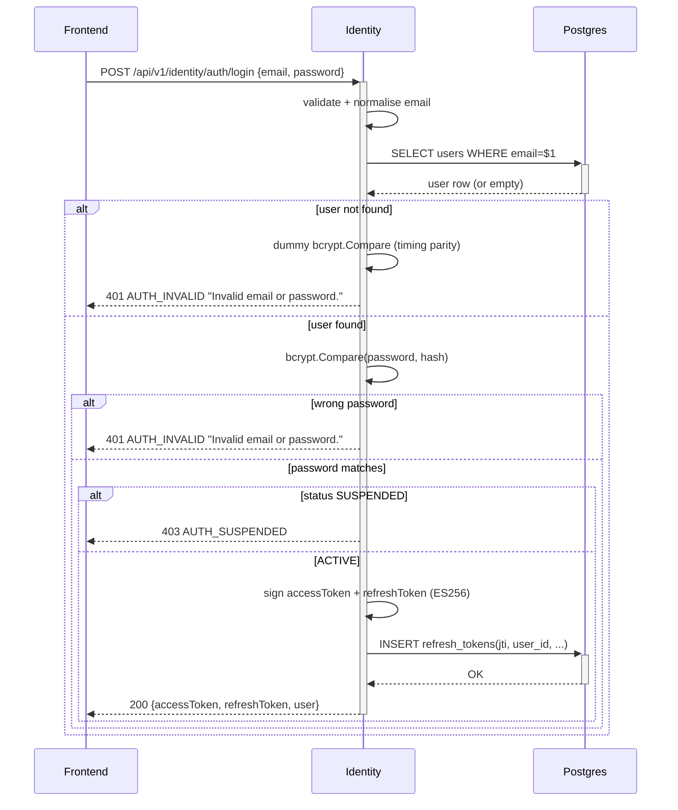

# POST /api/v1/identity/auth/login

## Summary

Customer-facing login. Verifies credentials with constant-time bcrypt compare (AUTH-007 timing equivalence), issues a fresh access + refresh token pair (ES256 JWT), and persists the refresh-token row for single-use rotation tracking. The token pair is returned in the response body; the Next.js frontend route handler converts them to HttpOnly cookies. Implements AUTH-002, AUTH-005, AUTH-006, AUTH-007.

## Story refs

- `STORY_AUTH_LOGIN`

## Contract ref

[`identity.login`](../../architecture/contracts.json) — `contract_version: 0.1.0`

## Auth

- Tier: **none** (public endpoint).
- On success, caller (frontend route handler) sets `access` and `refresh` HttpOnly cookies.

## Request

```json
{
  "$schema": "https://json-schema.org/draft/2020-12/schema",
  "type": "object",
  "additionalProperties": false,
  "required": ["email", "password"],
  "properties": {
    "email":    { "type": "string", "format": "email", "maxLength": 254 },
    "password": { "type": "string", "minLength": 1, "maxLength": 128 }
  }
}
```

## Response (success)

HTTP 200:

```json
{
  "code": "SUCCESS",
  "message": "Login successful",
  "data": {
    "accessToken":           "eyJhbGciOiJFUzI1NiIsInR5cCI6IkpXVCJ9...",
    "accessTokenExpiresAt":  "2026-05-08T10:15:00Z",
    "refreshToken":          "eyJhbGciOiJFUzI1NiIsInR5cCI6IkpXVCJ9...",
    "refreshTokenExpiresAt": "2026-05-22T10:00:00Z",
    "user": {
      "userId": "01935b9c-1234-7000-abcd-000000000001",
      "email":  "alice@example.com",
      "name":   "Alice",
      "role":   "CUSTOMER"
    }
  },
  "traceId": "0af7651916cd43dd8448eb211c80319c"
}
```

## Response (errors)

| Code | HTTP | Trigger |
|---|--:|---|
| `VALIDATION_ERROR` | 400 | Email format invalid or password empty |
| `AUTH_INVALID` | 401 | Wrong email OR wrong password — **SAME code + message "Invalid email or password." for both (AUTH-007 locked)** |
| `AUTH_SUSPENDED` | 403 | user.status = SUSPENDED |

## Business logic steps

1. Bind and validate request (`common/validator`); return `VALIDATION_ERROR` on failure.
2. Normalise email: `strings.TrimSpace(strings.ToLower(req.Email))`.
3. `SELECT id, password_hash, name, role, status FROM users WHERE email = $1`.
4. **If user not found:** run `common/hash.Compare(req.Password, sentinelDummyHash)` to maintain timing parity with the wrong-password path (prevents username-enumeration timing oracle per AUTH-007). Then return `AUTH_INVALID` with message `"Invalid email or password."`.
5. **bcrypt compare:** `common/hash.Compare(req.Password, user.password_hash)`. On mismatch: return `AUTH_INVALID` with message `"Invalid email or password."`.
6. If `user.status == SUSPENDED`: return `AUTH_SUSPENDED` (HTTP 403). Note: run the bcrypt compare BEFORE checking status to preserve constant-time behavior; do not short-circuit on status.
7. Generate `access_jti = uuid.NewV4()` and `refresh_jti = uuid.NewV4()`.
8. Sign access token (ES256, 15 min): claims `{sub: user.id, role, iat, exp, jti: access_jti, iss: "shoppilot-identity", aud: "shoppilot-api", tokenType: "ACCESS"}` via `common/token.SignES256`.
9. Sign refresh token (ES256, 14 days): claims `{sub: user.id, iat, exp, jti: refresh_jti, iss: "shoppilot-identity", aud: "shoppilot-api", tokenType: "REFRESH"}` via `common/token.SignES256`.
10. `INSERT INTO refresh_tokens(jti, user_id, issued_at, expires_at)`.
11. Return `common/wrapper.Success(ctx, data)` with both token strings and user sub-object.

## Side effects

- INSERT one row into `identity.refresh_tokens`.
- No outbox event.
- Caller (Next.js route handler) sets `access` and `refresh` HttpOnly cookies (SameSite=Lax, Secure, Path=/, Max-Age per respective TTLs).

## Idempotency

None — login is intentionally non-idempotent. Each successful call issues a new refresh-token row. Rate-limiting is out of scope for MVP.

## Performance

- p95 < 500ms (bcrypt cost 12 dominates at ~250–350ms).
- Expected QPS at MVP: 5–20.
- Constant-time compare adds negligible overhead (~same as a normal bcrypt compare).

## Sequence diagram



## Test cases

- `login_with_correct_credentials_returns_token_pair`
- `login_with_wrong_password_returns_AUTH_INVALID`
- `login_with_unknown_email_returns_AUTH_INVALID_same_message`
- `login_AUTH_INVALID_message_is_identical_for_wrong_email_and_wrong_password`
- `login_with_suspended_user_returns_AUTH_SUSPENDED`
- `login_with_invalid_email_format_returns_VALIDATION_ERROR`
- `login_password_compare_is_constant_time`
- `login_inserts_refresh_token_row`

## Change log

| Date | Author | Change |
|---|---|---|
| 2026-05-08 | Tech-Designer (Sonnet 4.6, dry-run #2) | Created |
