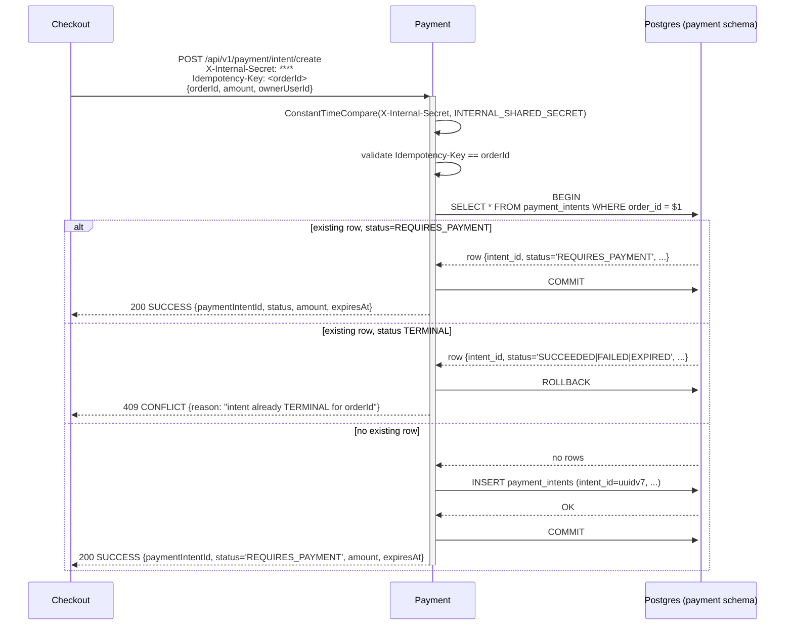

# POST /api/v1/payment/intent/create

## Summary

Create a payment intent for a freshly-created order. Called by Checkout as step 8 of the 9-step commit orchestration. Idempotent on `orderId` per cross-cutting.idempotency.internal_orderId_rule (ADR + REV-L2-006). Returns a `REQUIRES_PAYMENT` intent that the customer's frontend will subsequently drive via `payment.simulate`. Internal-only — authenticated via `X-Internal-Secret` per ADR-008; never exposed on the public gateway.

## Story refs

- `STORY_PAYMENT_INTENT_CREATE`

## Contract ref

[`payment.intent.create`](../../architecture/contracts.json#payment.intent.create)

## Auth

- Tier: **internal_secret**.
- Header `X-Internal-Secret: <INTERNAL_SHARED_SECRET value>` REQUIRED.
- Recipient validates via `crypto/subtle.ConstantTimeCompare` against the configured secret (ADR-008). Plain `==` / `!=` is FORBIDDEN.
- `INTERNAL_SHARED_SECRET` env-var name is the ONLY accepted name (ADR-008 LOCKED). MIN 32 bytes; comma-separated rotation overlap supported (`new,old`).
- On reject: 401 AUTH_INVALID; structured log `internal_auth_reject` with `remoteAddr`, `path`, `traceId`; NEVER log the supplied or expected secret value.

## Request

Headers:
- `Content-Type: application/json`
- `X-Internal-Secret: <secret>` (REQUIRED)
- `Idempotency-Key: <orderId UUID v7>` (REQUIRED — cross-cutting.idempotency.internal_orderId_rule; handler validates header == request.orderId else 400)

Body:

```json
{
  "$schema": "https://json-schema.org/draft/2020-12/schema",
  "type": "object",
  "additionalProperties": false,
  "required": ["orderId", "amount", "ownerUserId"],
  "properties": {
    "orderId":     { "type": "string", "format": "uuid" },
    "amount":      { "type": "integer", "minimum": 1, "description": "THB minor units (satang)" },
    "ownerUserId": { "type": "string", "format": "uuid", "description": "Cached from Checkout's identity.profile.read; pinned at create time so payment.simulate ownership check is a local row read" },
    "expiresAt":   { "type": "string", "format": "date-time", "description": "Optional; defaults to created_at + 15min (matches reservation TTL)" }
  }
}
```

## Response (success)

HTTP 200, envelope:

```json
{
  "code": "SUCCESS",
  "message": "payment intent created",
  "data": {
    "paymentIntentId": "01935b9c-2a17-7c3d-9e8f-a1b2c3d4e5f6",
    "status": "REQUIRES_PAYMENT",
    "amount": 248000,
    "expiresAt": "2026-05-08T18:15:00Z"
  },
  "traceId": "0af7651916cd43dd8448eb211c80319c"
}
```

## Response (errors)

| Code | HTTP | Trigger |
|---|--:|---|
| `VALIDATION_ERROR` | 400 | schema violation OR `Idempotency-Key` header != `request.orderId` |
| `AUTH_INVALID` | 401 | missing/wrong `X-Internal-Secret` (constant-time compare reject) |
| `CONFLICT` | 409 | intent already exists for `orderId` AND its status is TERMINAL (SUCCEEDED \| FAILED \| EXPIRED). Body carries `{ reason: "intent already TERMINAL for orderId", currentStatus, paymentIntentId }`. |
| `INTERNAL_ERROR` | 500 | DB failure or panic |
| `DATABASE_UNAVAILABLE` | 503 | pgx connect failure / pool exhaustion |

## Business logic steps

1. Validate `X-Internal-Secret` via `common/middleware/internal_auth.go` (constant-time compare). Reject 401 on miss.
2. Bind + validate request body against the schema above (`common/validator`).
3. Validate `Idempotency-Key` header == `request.orderId`; else 400 `VALIDATION_ERROR`.
4. `BEGIN` Postgres tx.
5. `SELECT * FROM payment_intents WHERE order_id = $1` (no FOR UPDATE — read-then-INSERT-or-return is fine because order_id has UNIQUE constraint that absorbs concurrent inserts).
6. If row exists AND `status = 'REQUIRES_PAYMENT'`: `COMMIT`; return 200 with the existing intent (idempotent replay).
7. If row exists AND `status` IN (SUCCEEDED, FAILED, EXPIRED): `ROLLBACK`; return 409 `CONFLICT` with current status + paymentIntentId.
8. If row does NOT exist: generate `intent_id = uuid.NewV7()`, `expires_at = now() + 15min` (or use `request.expiresAt` if provided and in future).
9. `INSERT INTO payment_intents (intent_id, order_id, owner_user_id, amount_minor, currency, status, expires_at, version, created_at, updated_at) VALUES ($1, $2, $3, $4, 'THB', 'REQUIRES_PAYMENT', $5, 0, now(), now())`.
10. On UNIQUE(order_id) violation (concurrent racer beat us): `ROLLBACK`, retry from step 4 once; on persistent failure return 500.
11. `COMMIT`.
12. Wrap response with `common/wrapper.Respond` (`code: SUCCESS`, `data: {paymentIntentId, status, amount, expiresAt}`).

## Side effects

- INSERT one row into `payment.payment_intents` (or no-op on idempotent replay).
- NO outbox event at create time (events are emitted only on terminal-state transitions via `process_callback`).
- NO cache invalidation.

## Idempotency

- Key shape: `Idempotency-Key` header MUST equal `request.orderId` (UUID v7).
- Scope: per-`orderId`. Backed by `UNIQUE (order_id)` constraint on `payment_intents`.
- TTL: row lives until intent reaches a terminal state AND retention horizon (>= 30 days; cleanup is future-iteration concern).
- Collision behavior: same orderId + REQUIRES_PAYMENT existing intent -> 200 with existing intent. Same orderId + TERMINAL existing intent -> 409 `CONFLICT`. Different `Idempotency-Key` than `orderId` -> 400 `VALIDATION_ERROR`.

## Performance

- p95 < 200ms (BA non_functional.latency for internal-internal calls).
- Expected QPS at MVP: 5-20 (one per successful checkout commit).
- Single-row insert; no downstream sync hops.

## Sequence diagram



## Test cases

- `intent_create_with_new_orderId_returns_REQUIRES_PAYMENT_intent`
- `intent_create_with_existing_REQUIRES_PAYMENT_orderId_returns_existing_intent`
- `intent_create_with_existing_TERMINAL_orderId_returns_409_CONFLICT`
- `intent_create_with_idempotency_key_not_equal_to_orderId_returns_400_VALIDATION_ERROR`
- `intent_create_with_missing_X_Internal_Secret_returns_401_AUTH_INVALID`
- `intent_create_with_wrong_X_Internal_Secret_returns_401_AUTH_INVALID_with_constant_time_compare`
- `intent_create_under_concurrent_requests_yields_exactly_one_intent_per_orderId`
- `intent_create_persists_owner_user_id_for_subsequent_simulate_ownership_check`
- `intent_create_logs_NEVER_contain_secret_value`

## Change log

| Date | Author | Change |
|---|---|---|
| 2026-05-08 | Tech-Designer (Claude Opus 4.7 1M, dry-run #2) | Created. Auth tier corrected to `internal_secret` per ADR-008; `Idempotency-Key=orderId` rule enforced at handler boundary; `ownerUserId` cached at create time per REV-L2 follow-up. |
