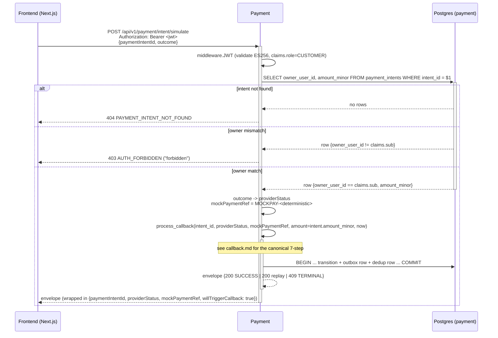

# POST /api/v1/payment/intent/simulate

## Summary

Customer-facing mock-payment endpoint. Translates the customer's chosen `outcome` (success | failed | timeout) into a provider-grade `providerStatus` (SUCCEEDED | FAILED | EXPIRED), generates a deterministic `mockPaymentRef`, and INVOKES the canonical `process_callback()` 7-step handler in-process. Does NOT directly write `payment_intents.status` — every state transition flows through `process_callback` so the simulate path and the real-webhook path share the SAME idempotency, dedup, and outbox semantics.

## Story refs

- `STORY_PAYMENT_SIMULATE_SUCCESS`
- `STORY_PAYMENT_SIMULATE_FAILED_OR_TIMEOUT`

## Contract ref

[`payment.simulate`](../../architecture/contracts.json#payment.simulate)

## Auth

- Tier: **customer_jwt** (role=CUSTOMER required).
- `Authorization: Bearer <ACCESS jwt>` REQUIRED.
- After common JWT middleware validates signature/iss/aud/exp, the handler reads `payment_intents.owner_user_id` for the supplied `paymentIntentId` and compares against `claims.sub` via constant-time compare. Mismatch returns 403 `AUTH_FORBIDDEN` with a generic `forbidden` message — NEVER leak ownership to the caller (no `not your order` text).
- ADMIN role is REJECTED with 403 (this endpoint is customer-driven; admins use ops tooling, not the simulate route).

## Request

Headers:
- `Authorization: Bearer <ACCESS jwt; role=CUSTOMER>` (REQUIRED)
- `Content-Type: application/json`

Body:

```json
{
  "$schema": "https://json-schema.org/draft/2020-12/schema",
  "type": "object",
  "additionalProperties": false,
  "required": ["paymentIntentId", "outcome"],
  "properties": {
    "paymentIntentId": { "type": "string", "format": "uuid" },
    "outcome":         { "type": "string", "enum": ["success", "failed", "timeout"] }
  }
}
```

## Response (success)

HTTP 200, envelope:

```json
{
  "code": "SUCCESS",
  "message": "callback applied",
  "data": {
    "paymentIntentId": "01935b9c-2a17-7c3d-9e8f-a1b2c3d4e5f6",
    "providerStatus": "SUCCEEDED",
    "mockPaymentRef": "MOCKPAY-AB3CDEF1KL",
    "willTriggerCallback": true
  },
  "traceId": "0af7651916cd43dd8448eb211c80319c"
}
```

## Response (errors)

| Code | HTTP | Trigger |
|---|--:|---|
| `VALIDATION_ERROR` | 400 | `paymentIntentId` not UUID OR `outcome` not in enum |
| `AUTH_MISSING` | 401 | no `Authorization` header |
| `AUTH_INVALID` | 401 | JWT signature/iss/aud/exp invalid |
| `AUTH_FORBIDDEN` | 403 | `claims.role != CUSTOMER` OR `claims.sub != intent.owner_user_id` |
| `PAYMENT_INTENT_NOT_FOUND` | 404 | no `payment_intents` row matches `paymentIntentId` |
| `PAYMENT_INTENT_TERMINAL` | 409 | intent already TERMINAL AND incoming outcome maps to a different `providerStatus` (returned by `process_callback` Step 5) |
| `INTERNAL_ERROR` | 500 | DB failure or panic |

## Business logic steps

1. Common JWT middleware validates the access token (`common/middleware.JWT`).
2. Bind + validate body (`common/validator`); reject `VALIDATION_ERROR` on schema miss.
3. `SELECT owner_user_id, amount_minor FROM payment_intents WHERE intent_id = $1`. If no row, return 404 `PAYMENT_INTENT_NOT_FOUND`.
4. If `claims.role != CUSTOMER`, return 403 `AUTH_FORBIDDEN`.
5. If `claims.sub != intent.owner_user_id` (via `crypto/subtle.ConstantTimeCompare` on the UUID byte representations to keep the path branch-agnostic), return 403 `AUTH_FORBIDDEN` with generic message.
6. Map `outcome` -> `providerStatus`: `success -> SUCCEEDED`, `failed -> FAILED`, `timeout -> EXPIRED`.
7. Compute `mockPaymentRef = "MOCKPAY-" + base32(sha256(intent_id || outcome))[:10]` — deterministic so re-simulate yields the same ref.
8. Read `provider_timestamp = clock.Now()` (via `common/clock`).
9. Call `process_callback(intent_id, provider_status, mock_provider_ref, amount_from_caller=intent.amount_minor /* server-trusted */, provider_timestamp)` IN-PROCESS — does not cross the HTTP boundary; same goroutine.
10. `process_callback` returns an envelope (200 SUCCESS on apply | 200 replay-cached on duplicate same-status | 409 PAYMENT_INTENT_TERMINAL on terminal-different-status).
11. Wrap the envelope with `data = {paymentIntentId, providerStatus, mockPaymentRef, willTriggerCallback: true}`. The constant `willTriggerCallback: true` mirrors the public contract — in MVP the callback is already applied at this point, but the field name preserves contract shape for a future provider integration.
12. Respond.

## Side effects

(Delegated to `process_callback`; see [`callback.md`](./callback.md) for the canonical 7-step:)
- On dedup-clear: UPDATE `payment_intents` (status, mock_provider_ref, provider_status, paid_at, version+1), INSERT `outbox_events` row (SUCCEEDED -> `payment.completed`; FAILED -> `payment.failed`; EXPIRED -> NO event), INSERT `payment_callback_dedup` row — all in ONE Postgres tx.
- On replay (same outcome): no writes; cached envelope returned.
- On terminal-different (e.g., already-SUCCEEDED, customer clicks 'failed'): cached 409 envelope; no state change.

## Idempotency

- First simulate wins. Subsequent simulate with the SAME outcome on a TERMINAL intent returns 200 with the cached envelope (`process_callback` Step 4 replay branch).
- Subsequent simulate with a DIFFERENT outcome on a TERMINAL intent returns 409 `PAYMENT_INTENT_TERMINAL` (`process_callback` Step 5 terminal-state guard).
- Dedup window: 30 days (matches cross-cutting.idempotency for payment.callback).
- The simulate endpoint shares its dedup window with the webhook because both call `process_callback` and write to the SAME `payment_callback_dedup` table.

## Performance

- p95 < 300ms (BA non_functional.latency for customer-facing endpoints; matches the 1.4-second processing animation budget on the frontend payment route per Frontend Spec §3).
- Expected QPS at MVP: 1-5 (one per customer interacting with the mock payment screen).
- The 1.4-second animation on the frontend payment route is a UI-side delay — the backend response itself MUST stay well under 300ms so the frontend can navigate to `orderResult` once the animation completes without the server being the bottleneck.

## Sequence diagram



## Test cases

- `simulate_success_transitions_intent_SUCCEEDED_and_emits_payment_completed_outbox`
- `simulate_failed_transitions_intent_FAILED_and_emits_payment_failed_outbox`
- `simulate_timeout_transitions_intent_EXPIRED_and_emits_NO_outbox_event`
- `simulate_persists_mock_provider_ref_provider_status_paid_at` (PAY-007)
- `simulate_with_no_JWT_returns_401_AUTH_MISSING`
- `simulate_with_invalid_JWT_returns_401_AUTH_INVALID`
- `simulate_by_non_owner_returns_403_AUTH_FORBIDDEN_with_generic_message`
- `simulate_with_admin_role_returns_403_AUTH_FORBIDDEN`
- `simulate_with_unknown_paymentIntentId_returns_404_PAYMENT_INTENT_NOT_FOUND`
- `simulate_replay_same_outcome_returns_cached_envelope_no_new_outbox`
- `simulate_replay_different_outcome_after_terminal_returns_409_PAYMENT_INTENT_TERMINAL`
- `simulate_concurrent_calls_yield_exactly_one_terminal_state_one_outbox_row`
- `simulate_logs_NEVER_contain_outcome_or_mock_provider_ref_in_redacted_paths`

## Change log

| Date | Author | Change |
|---|---|---|
| 2026-05-08 | Tech-Designer (Claude Opus 4.7 1M, dry-run #2) | Created. Ownership check pinned to `payment_intents.owner_user_id` cached at intent.create time (no sync hop to identity/order). Generic `forbidden` message on AUTH_FORBIDDEN to prevent ownership leakage. Constant-time compare on the UUID compare. |
